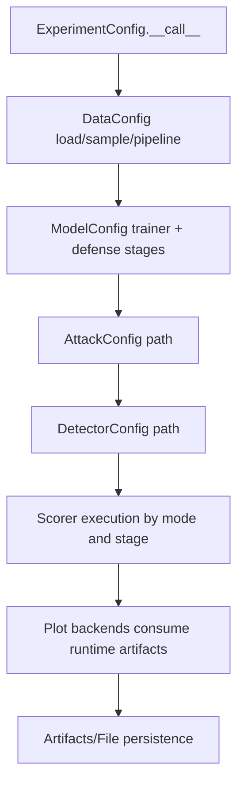
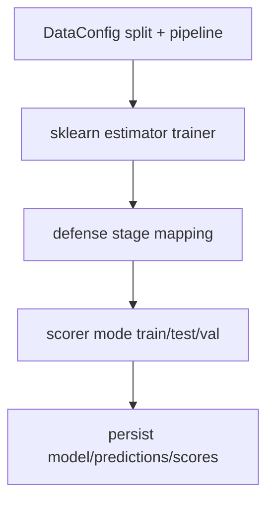
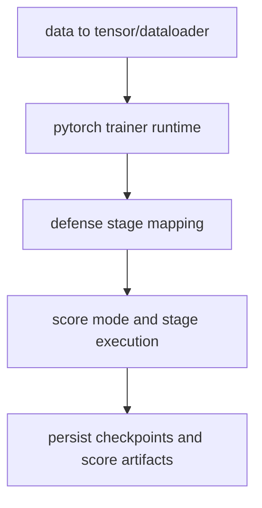
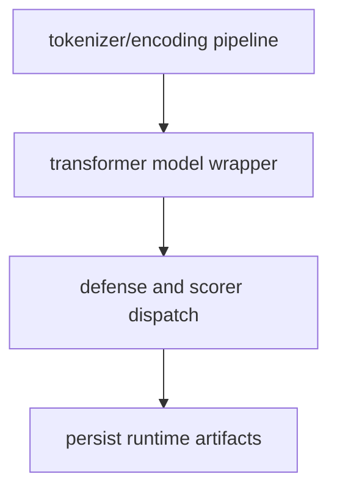
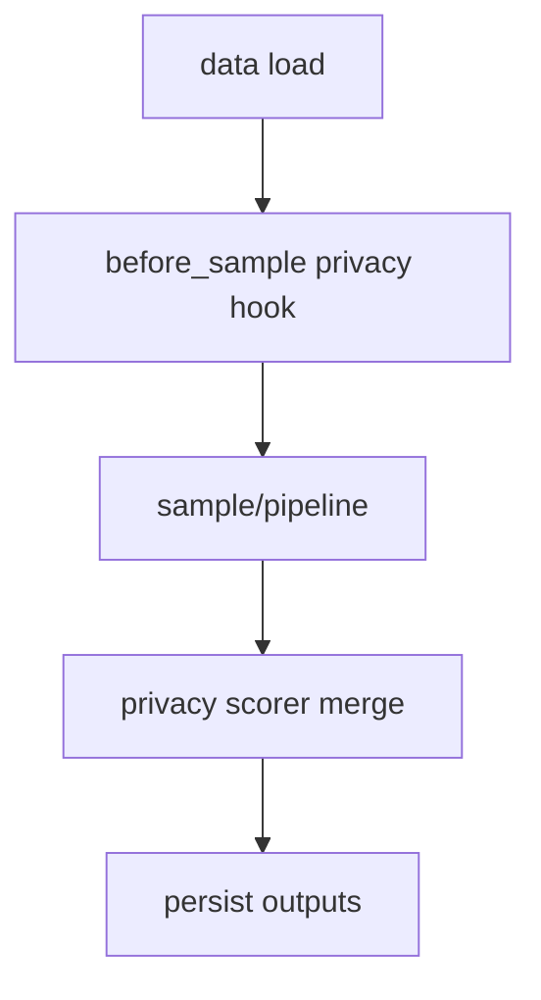
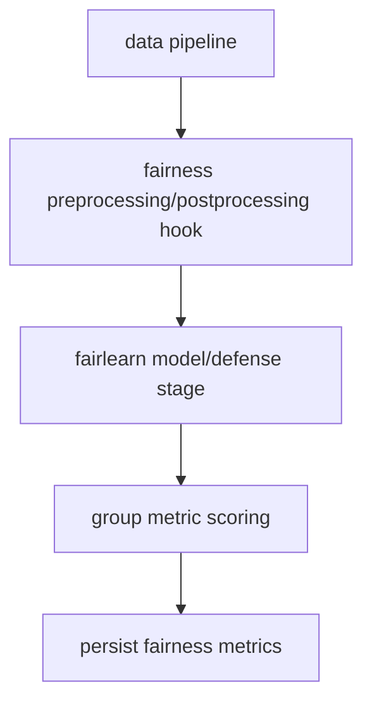
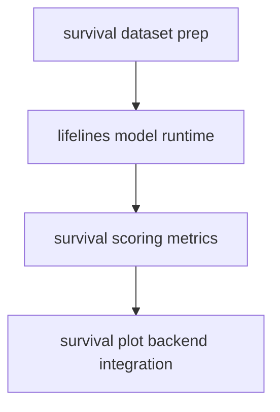
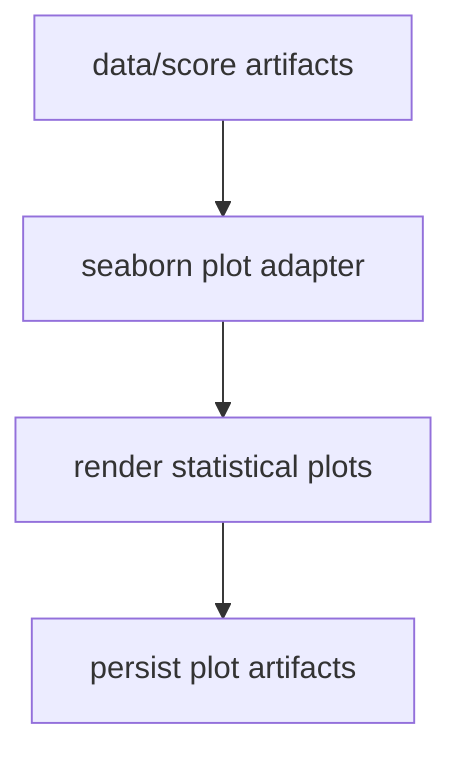
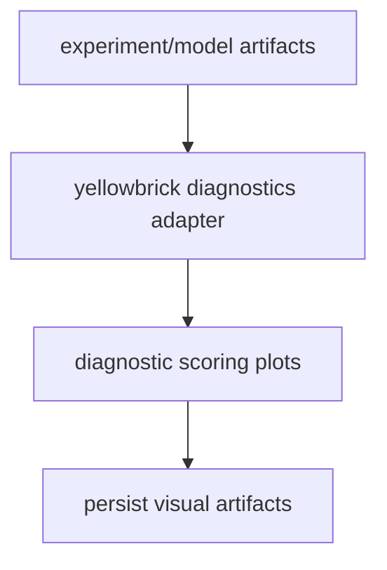

# Plugin and Hook Execution Reference

This document is the canonical developer reference for plugin and framework hook
execution in Deckard.

Use this page for implementation details. Overview pages should stay concise and
focus on execution order.

## Scope

This reference covers hook and runtime flow behavior for:

- frameworks: sklearn, pytorch, transformers
- plugins: anjana, fairlearn, lifelines, seaborn, yellowbrick

Across runtime concerns:

- data
- pipeline
- defense
- scoring
- plot

## Hook Ownership Matrix

| Concern | Primary owner | Hook surface examples |
| --- | --- | --- |
| Data load/sample/pipeline | DataConfig | before_load_data, before_sample, before_pipeline, after_pipeline |
| Data score stages | DataConfig + scorer | before_score_pre_sample, after_score_post_pipeline |
| Model trainer lifecycle | ModelConfig + trainer runtime | before_train_or_load_model, after_train_or_load_model |
| Model defense stages | ModelConfig + DefensePipeline | pre_art_defense, pre_fit, post_fit_pre_predict |
| Attack lifecycle | AttackConfig | pre-attack, post-attack, benign, adversarial |
| Detector lifecycle | DetectorConfig | pre-fit, post-fit, pre-detect, post-detect |
| Experiment orchestration | ExperimentConfig | before/after load, sample, train, attack, defense, score, persist |
| Plot backend runtime | PlotConfig + backend wrappers | backend-specific setup/render hooks |

## Canonical End-to-End Composition



The framework/plugin layers should adapt behavior at these boundaries without
replacing canonical orchestration ownership.

## Framework Flows

### sklearn



Typical config:

```yaml
model:
  _target_: deckard.model.base.ModelConfig
  model_type: sklearn.ensemble.RandomForestClassifier
  trainer:
    _target_: deckard.model.trainer.base.SklearnTrainerConfig
  defense:
    pipeline:
      - name: art.defences.preprocessor.FeatureSqueezing
        apply_fit: false
        apply_predict: true
```

### pytorch



Typical config:

```yaml
model:
  _target_: deckard.frameworks.pytorch.model.PytorchModelConfig
  trainer:
    _target_: deckard.model.trainer.base.PytorchTrainerConfig
  model_type: my_file.py:MyModelClass
  model_params:
    input_features : 3 
    output_classes : 10
  fit_params:
    epochs: 3
    lr: 0.001
```

### transformers



Typical config:

```yaml
model:
  _target_: deckard.frameworks.transformers.model.TransformersModelConfig
  model_type: transformers.AutoModelForSequenceClassification
  tokenizer: transformers.AutoTokenizer
```

## Plugin Flows

### anjana



Typical config:

```yaml
data:
  _target_: deckard.plugins.anjana.data.AnjanaDataConfig
  anjana_defense:
    k: 2
score:
  data:
    _target_: deckard.plugins.anjana.score.DefaultAnjanaScorerDictConfig
```

### fairlearn



Typical config:

```yaml
data:
  _target_: deckard.plugins.fairlearn.data.FairlearnDataConfig
model:
  _target_: deckard.plugins.fairlearn.model.FairlearnModelConfig
score:
  model:
    _target_: deckard.plugins.fairlearn.score.FairlearnScorerDictConfig
```

### lifelines



Typical config:

```yaml
model:
  _target_: deckard.plugins.lifelines.model.SurvivalModelConfig
score:
  c_index:
    score_function: lifelines.utils.concordance_index
    stage : [test, val]
```

### seaborn



Typical config:

```yaml
plot:
  _target_: deckard.plugins.seaborn.plot.SeabornPlotConfig
  files:
    plot_file: outputs/seaborn_summary.png
```

### yellowbrick



Typical config:

```yaml
plot:
  _target_: deckard.plugins.yellowbrick.plot.YellowbrickPlotConfig
  files:
    plot_file: outputs/yellowbrick_diagnostic.png
```

## Standardization Rules

- Keep core orchestration in base Config runtimes.
- Keep framework/plugin behavior policy-specific and thin.
- Emit stage-aware hooks, but keep score mode split-scoped.
- Persist through canonical file aliases and artifacts utilities.
- Add contract tests when introducing new hook stages or plugin branches.
