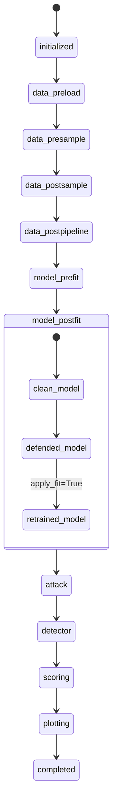

# Persistence and Runtime State Contract

This document defines the final persistence/runtime-state contract for Deckard.
It is based on the current implementation surfaces in:

- `deckard/artifacts.py` (`ArtifactLoaderConfig` serializer/loader dispatch)
- `deckard/file.py` (`FileConfig`, `AbstractFileHandler`, `CanonFileHandler`)
- canonical runtime helpers:
  - `deckard/data/canon.py`
  - `deckard/model/canon.py`
  - `deckard/attack/canon.py`
  - `deckard/detector/canon.py`
  - `deckard/score/canon.py`
  - `deckard/plot/canon.py`

## Goals

- Support a YAML and/or PKL state machine for resumable runs.
- Keep writes/reads declarative (what to persist, not how to serialize in every caller).
- Use OmegaConf resolution for config restoration (`from_yaml`).
- Resume an experiment at any stage in the data/model/defense/attack/detector pipeline.
- Support pretrained models, pre-split data, pre-transformed data, and pre-defended pipelines.
- Provide one unified file parsing interface for key validation/placeholders/status.
- Keep configuration hash stable after initialization.
- Improve reproducibility and auditability.

## Current Contract Summary

### Config identity and YAML IO

`BaseConfig` already provides the core control-plane behavior:

- initialization-time frozen hash payload (`_hash_payload`) and hash value (`_hash_value`)
- YAML round-trip (`to_yaml`, `from_yaml`) with OmegaConf `resolve=True`
- dictionary serialization (`to_dict`) for nested configs

This means the configuration identity contract is already mostly in place.

### Artifact serialization

`ArtifactLoaderConfig` already performs payload-kind + file-suffix dispatch:

- scores: `.csv`, `.json`, `.xlsx`
- data tables: `.csv`, `.parquet`, `.pkl`, `.html`, `.json`, `.xlsx`
- objects/models: `.pkl`, `.pickle`, `.joblib`, `.pt`

This should remain the data-plane serializer contract.

### File schema and parsing

`FileConfig` + `CanonFileHandler` already provide:

- TypedDict-key validation across model/data/attack/detector/log aliases
- placeholder parsing and replacement
- disk-status checks

This is the right base for a unified file parsing interface.

### Runtime canon coverage

Canon modules define stage/mode/timing expectations:

- data: stage hooks, split modes, canonical `times`, canonical files
- model: training/prediction timing + defense-stage ordering
- score: score-mode + stage token normalization
- attack/detector: runtime stage aliases and timing keys
- plot: backend normalization and runtime contract shape

These modules should be treated as the source-of-truth for checkpoint stage tokens.

## Final Architecture

Use a two-layer persistence model.

1. Control plane (YAML): run state machine metadata and references.
2. Data plane (PKL/CSV/PT/etc): heavy payload artifacts.

### Control-plane file

Canonical path: `state_file` (YAML; JSON allowed as compatibility alias).

Minimal schema:

```yaml
schema_version: 1
run_id: <stable_config_hash>
parent_run_id: null
config_yaml: path/to/resolved_config.yaml
status: running|paused|completed|failed
current_stage: data.post-pipeline
completed_stages:
  - data.pre-load
  - data.pre-sample
artifacts:
  data:
    data_file: ...
    post_sample_data_file: ...
  model:
    model_file: ...
    test_predictions_file: ...
  attack: {}
  detector: {}
  score:
    score_file: ...
times:
  data_load_time: 0.42
  training_time: 4.12
checksums:
  data_file: sha256:...
```

### Data-plane files

Use existing `ArtifactLoaderConfig` behavior. Do not duplicate serializer logic
in runtime call paths.

### Path and storage compatibility

The persistence contract must accept both:

- Any local filesystem path (relative or absolute) for control/data-plane files.
- Any RDB storage URI/path for DB-backed runtime data sources (for example
  Optuna studies):
  - URI forms: `sqlite:///...`, `postgresql://...`, `mysql://...`, etc.
  - local DB file paths (for example `./optuna.db`, `/tmp/study.sqlite3`) that
    are normalized to canonical URI form by runtime loaders.

Rule: core persistence state (`state_file`, config YAML, artifact files) remains
file-based, while optional DB-backed datasets/metadata references are stored as
opaque, normalized storage strings in state metadata.

## Runtime State Machine

Canonical stage tokens should be namespaced by component and canon stage:

- `data.pre-load`, `data.pre-sample`, `data.post-sample`, `data.post-pipeline`
- `model.pre_art_defense`, `model.pre_fit`, `model.post_fit_pre_predict`
- `attack.pre-attack`, `attack.post-attack`
- `detector.pre-fit`, `detector.post-fit`, `detector.pre-detect`, `detector.post-detect`
- `score.<score_mode>` (using `deckard.score.canon` modes)
- `plot.<backend>`



Resume rule: if a stage is in `completed_stages` and all required artifacts are
available with valid checksum, skip execution and hydrate runtime fields.

## Declarative Read/Write Contract

Every runtime `__call__` path should follow this shape:

1. Resolve runtime `files` via `FileConfig` aliases.
2. Resolve stage token via canon helper.
3. Read `state_file`.
4. If resumable stage checkpoint exists and is valid: hydrate + skip.
5. Execute stage.
6. Persist stage artifacts via `ArtifactLoaderConfig`.
7. Merge canonical times/scores/files.
8. Atomically update `state_file`.

Required write invariants:

- Never write partially-updated state (write temp then rename).
- Persist `completed_stages` only after artifact write succeeds.
- Persist hash-stable `run_id` once; never mutate in-place.

## Unified File Parsing Interface

`AbstractFileHandler` is the contract boundary.

Required operations:

- `validate_keys`
- `disk_status`
- `parse_placeholders`
- `replace_placeholders`

`FileConfig` remains the public typed registry and should delegate parsing/
validation to handler implementations.

## Hash and Reproducibility Contract

### Hash stability

- Config hash is frozen in `BaseConfig._after_post_init`.
- Runtime fields (`score_dict`, predictions, timing values) must stay excluded
  from hash payload.
- `run_id` must equal this frozen hash and must not change after initialization.

### Reproducibility metadata

Persist in state metadata:

- resolved config YAML path
- random seeds used by component (data/model/attack/detector)
- package versions (minimum: deckard, sklearn, torch, optuna)
- artifact checksums

## Resume Scenarios (Required)

1. Pretrained model with new defenses:
   - load model checkpoint
   - snapshot pre-defense score/timing state
   - apply new defense chain with stage ordering from model canon
   - retrain only when defense policy requires `apply_fit=True`

2. Pre-split data:
   - if train/test/val artifacts exist and checksum passes, skip sampling stage

3. Pre-transformed data:
   - if `post_pipeline_data_file` exists, skip pipeline transform stage

4. Mid-pipeline resume:
   - restart from `current_stage` using completed-stage graph and artifact checks

5. Attack/detector continuation:
   - reuse cached model/data payloads and rerun only missing attack/detector stages

## OmegaConf and from_yaml Rules

- All control-plane config restoration must use `BaseConfig.from_yaml`.
- Always load with `OmegaConf.load(..., resolve=True)`.
- Persist a fully-resolved config snapshot before first execution stage.

## Migration Plan

### Phase A: Contract wiring

- Add `state_file` alias to canonical file mappings.
- Add shared state helpers (`load_state`, `save_state_atomic`, `update_stage_state`).
- Route all major runtime `__call__` paths through state read/write helper.

### Phase B: Resume coverage

- Implement stage-skip hydration for data/model/attack/detector.
- Add explicit checkpoints around defense chain boundaries.
- Add checksum verification hooks.

### Phase C: Hardening and docs

- Add failure-recovery semantics (`failed_stage`, `last_error`).
- Add end-to-end tests for resume at each stage boundary.
- Add user-facing examples for pretrained/pre-split/pre-transformed resumes.

## Test Matrix (Minimum)

- Fresh run, no prior artifacts.
- Resume from each canonical data stage.
- Resume from post-fit model state with added defenses.
- Resume with pretrained model + apply-fit defense.
- Resume attack-only and detector-only stages.
- Resume with pre-split and pre-transformed data.
- Hash immutability check across runtime mutations.
- YAML round-trip (`to_yaml` -> `from_yaml`) preserving identity.

## Non-Goals

- Replacing artifact payload formats already supported by `ArtifactLoaderConfig`.
- Forcing all payloads into one file format.
- Introducing framework-specific persistence branches into core runtime contracts.
