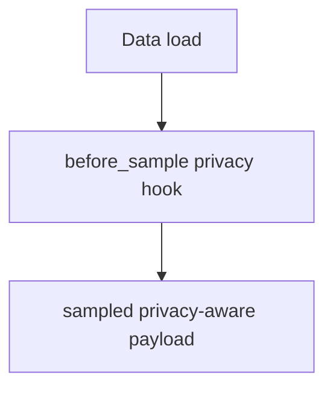
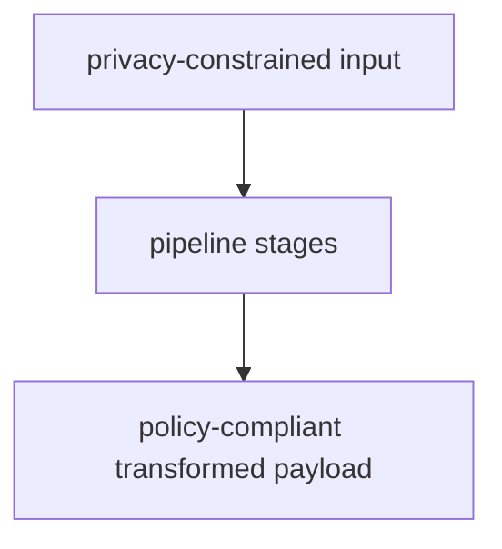
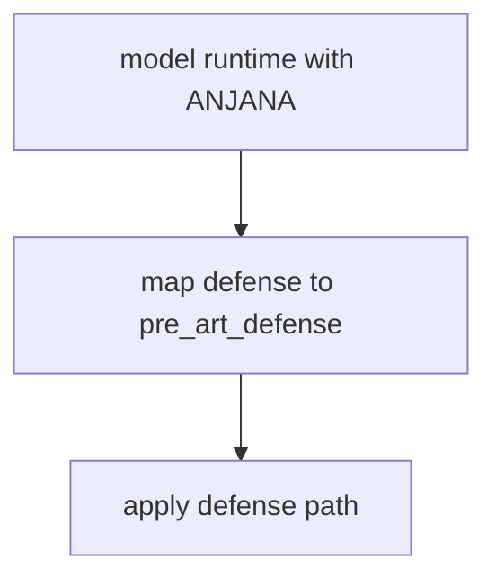
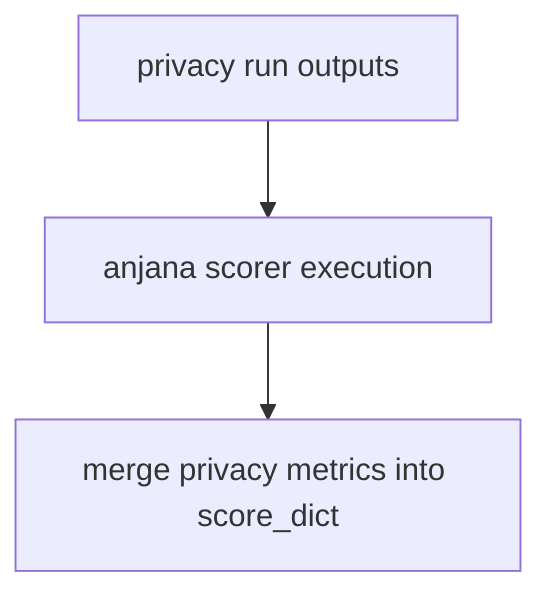
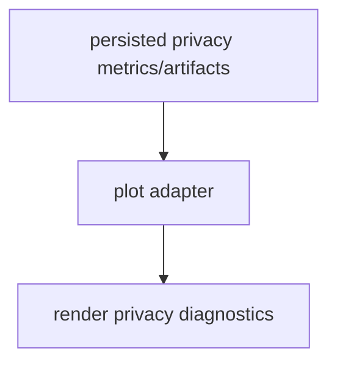

# ANJANA Plugin Overview

This overview focuses on ANJANA execution order.

For comprehensive hook ownership and policy details, see
[Plugin and Hook Execution Reference](../developers/plugin_hook_execution.md).

Related docs:

- [Data Guide](data.md)
- [Pipeline Guide](pipeline.md)
- [Model Guide](model.md)
- [Defense Guide](defense.md)
- [Scoring Guide](scoring.md)
- [Files Guide](file.md)
- [Artifacts Guide](artifacts.md)
- [Experiment Guide](experiment.md)
- [Plot Guide](plot.md)

## Execution Order

1. Data load and pre-sample privacy hook execution.
2. Optional pipeline transforms with policy constraints.
3. Defense stage alignment with model runtime where applicable.
4. Privacy-oriented scorer merge.
5. Canonical persistence and optional plotting.

## Execution Flows

### Data Flow



### Pipeline Flow



### Defense Flow



### Scoring Flow



### Plot Flow



## YAML Examples

```yaml
data:
  _target_: deckard.plugins.anjana.data.AnjanaDataConfig
  anjana_defense:
    k: 2
```

```yaml
score:
  data:
    _target_: deckard.plugins.anjana.score.DefaultAnjanaScorerConfig
```
