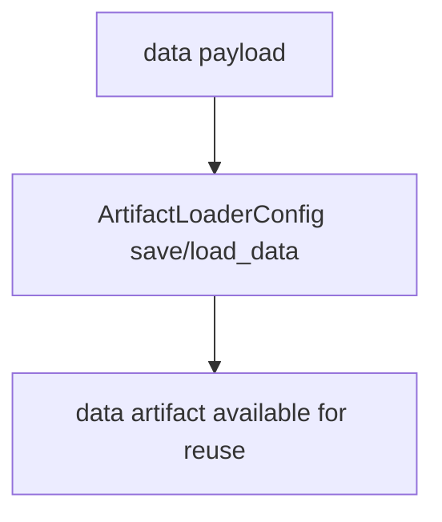
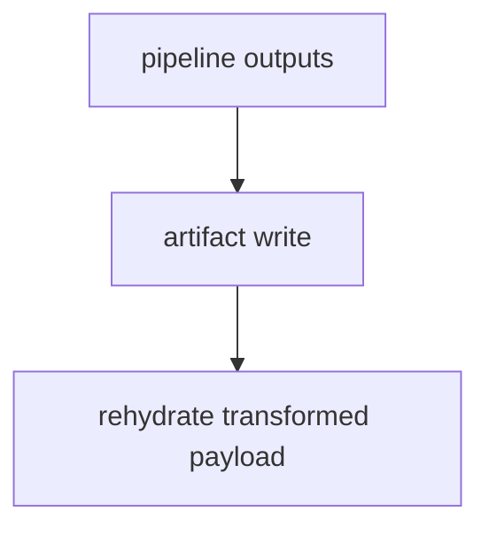
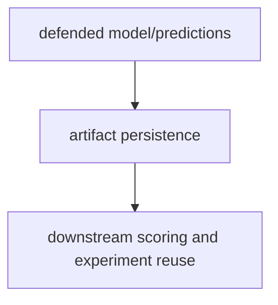
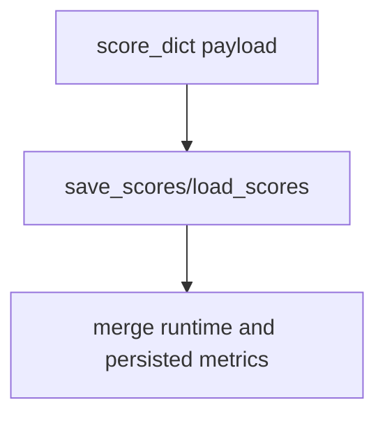
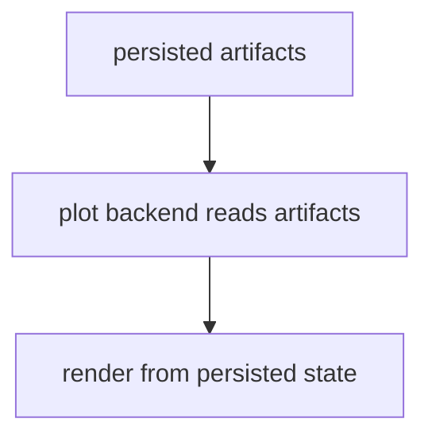

# Artifacts Guide for Base Config Objects

This guide summarizes artifact persistence behavior for all base runtime configs.

For comprehensive hook ownership and policy details, see
[Plugin and Hook Execution Reference](../developers/plugin_hook_execution.md).

Related APIs:

- [File API](../api/file)
- [Artifacts API](../api/artifacts)
- [Experiment API](../api/experiment)
- [Plot API](../api/plot)
- [Utils API](../api/utils)

## Core Role

ArtifactLoaderConfig owns canonical load/save behavior across score, data,
model, and object payloads, while core runtimes consume those APIs rather than
implementing duplicate codecs.

## Execution Order

1. Resolve canonical file aliases from runtime files mapping.
2. Select serializer/loader by payload type and suffix.
3. Save or load artifact payload.
4. Merge metadata into runtime score/files state.
5. Expose rehydratable artifacts for rerun/cache paths.

## Persistence Rules

- use files-only aliases as persistence inputs
- route serializer behavior by artifact type and suffix
- preserve human-readable score artifacts where possible

## Execution Flows

### Data Flow



### Pipeline Flow



### Defense Flow



### Scoring Flow



### Plot Flow



## YAML Examples

```yaml
files:
  _target_: deckard.file.FileConfig
  data_file: outputs/data.pkl
  model_file: outputs/model.pkl
  score_file: outputs/scores.json
```

```yaml
experiment:
  files:
    params_file: outputs/params.yaml
    score_file: outputs/scores.json
```

## Quick Checklist

- Is persistence delegated to artifacts helpers?
- Are file aliases canonical and deterministic?
- Are artifacts rehydratable for rerun/cache paths?
