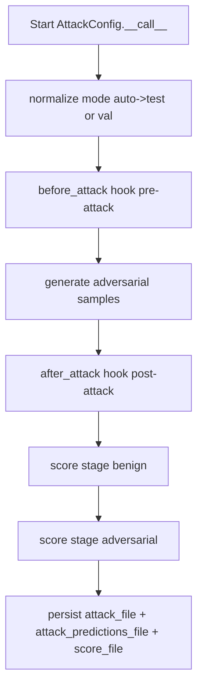
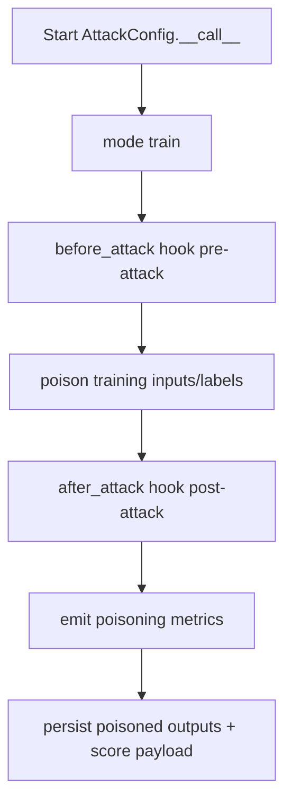
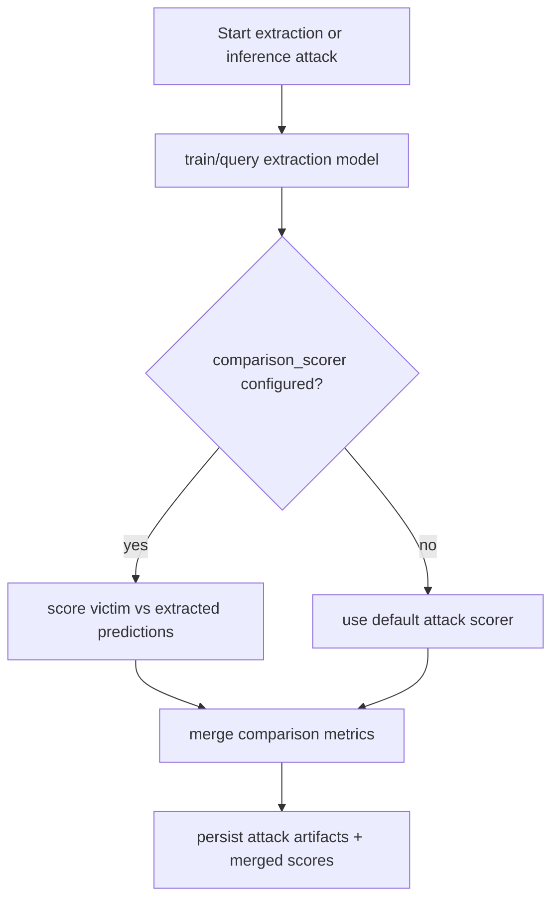

# Attack Guide for Base Config Objects

This guide documents attack runtime behavior for the base attack configuration:

- AttackConfig

It covers attack defaults, mode and stage semantics, output conventions, and
how attack scoring integrates with canonical persistence.

Related APIs:

- [Attack API](../api/attack)
- [Score API](../api/score)
- [File API](../api/file)
- [Experiment API](../api/experiment)

## Core Concepts

### mode vs stage

- mode selects split/runtime context (`auto`, `train`, `test`, `val`).
- stage identifies attack lifecycle boundaries (`pre-attack`, `post-attack`,
  `benign`, `adversarial`).

Rule:

- mode answers where attack inputs are selected from.
- stage answers when attack scores were emitted.

### Attack Runtime Contract

AttackConfig standardizes:

- files-only persistence inputs/outputs
- canonical timing fields for generation, prediction, and scoring
- score_dict merge-safe score aggregation
- stage-aware hook/plugin dispatch

## Defaults

- mode default: `auto`
- scorer default: `deckard.score.attack.AttackScorerConfig`
- canonical stage aliases normalize to `pre-attack` and `post-attack`

## Typical Flow

At a high level, an attack run is:

1. resolve/initialize attack object
2. select split inputs from mode
3. generate adversarial outputs
4. score benign/adversarial behavior
5. persist attack artifacts through files

## Execution Flows

### Flow 1: Evasion Attack (test/val path)

This is the common adversarial-evasion path. Runtime emits pre/post attack
hooks, computes benign and adversarial scores, and persists attack artifacts.



### Flow 2: Poisoning Attack (train path)

Poisoning flows target training data and typically affect downstream model
training. The scoring path still uses canonical stage semantics and files-only
persistence.



### Flow 3: Extraction/Inference Comparison Path

Extraction and inference attacks can compare victim and extracted behavior.
Runtime applies comparison scorer logic in a dedicated branch so these metrics
remain compatible with canonical score merging.



## Programmatic Example

```python
from deckard.attack import AttackConfig

cfg = AttackConfig(
    attack_type="art.attacks.evasion.FastGradientMethod",
    attack_params={"eps": 0.1},
    mode="test",
)

scores = cfg(data=my_data_cfg, model=my_model_cfg)
print(scores)
```

## YAML Example

```yaml
attack:
  _target_: deckard.attack.base.AttackConfig
  attack_type: art.attacks.evasion.FastGradientMethod
  mode: test
  attack_params:
    eps: 0.1
  files:
    attack_file: outputs/attack.pkl
    attack_predictions_file: outputs/attack_predictions.pkl
    score_file: outputs/attack_scores.json
```

## Recommended Practices

- Keep attack mode split-scoped, not stage-scoped (e.g. poisoning attacks measure against the `train` set and evasion against `val` or `test`).
- Use stages for lifecycle reporting and hook routing.
- Persist attack outputs via files so reruns can be cache-aware.
- Keep backend-specific attack behavior in wrappers, not core runtime flow.

## Quick Checklist

- Is mode selecting the intended split?
- Are stage names lifecycle-oriented and canonical?
- Are attack outputs persisted through files-only paths?
- Are attack scores merge-safe in score_dict?
