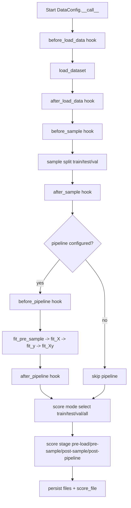
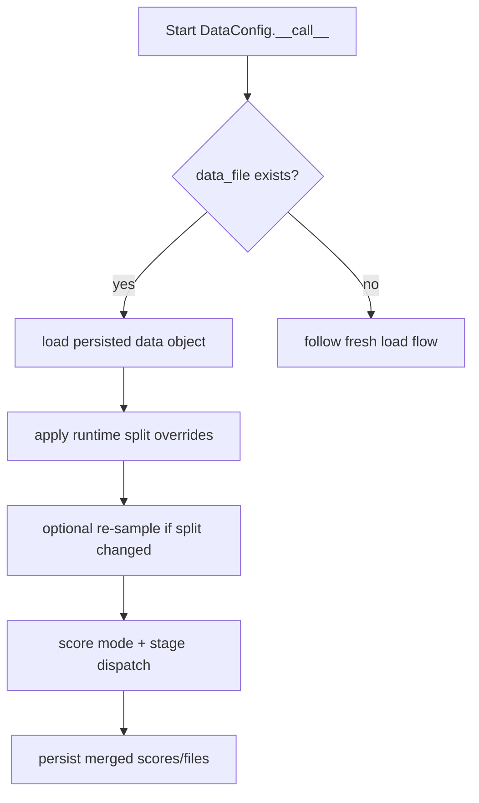

# Data Guide for Base Config Objects

This guide documents data runtime behavior for Deckard base configs, centered on:

- DataConfig
- DataPipeline runtime composition
- score_mode and scorer stage interaction
- files and timing persistence contracts

It complements the API details in:

- [Data API](../api/data)
- [Pipeline API](../api/pipeline)
- [Score API](../api/score)
- [File API](../api/file)
- [Sample API](../api/sample)

## Core Concepts

### Runtime ownership

DataConfig is the canonical runtime owner for:

- dataset loading
- sampling into train/test/val
- optional preprocessing pipeline execution
- stage-aware score hook dispatch
- data scoring and persistence orchestration

DataConfig remains available as a legacy alias of DataConfig for
compatibility with existing configs.

### Pipeline runtime object

Optional preprocessing is executed by a DataPipeline runtime object attached to
DataConfig.pipeline.

Execution order is stage-based:

1. fit_pre_sample
1. fit_X
1. fit_y
1. fit_Xy

Each stage supports before and after plugin hooks and score-stage hook dispatch.

### score_mode vs scorer stage

- score_mode selects split scope: train, test, val, all.
- scorer stage identifies lifecycle timing: pre-load, pre-sample, post-sample,
  post-pipeline.

Rule:

- score_mode answers where scores are computed from.
- stage answers when in the lifecycle scoring was emitted.

## Defaults and Contracts

### DataConfig defaults

- score_mode defaults to post-pipeline orchestration behavior
- score_split defaults to test
- scorer defaults by task family:
  - classification: deckard.score.data.DefaultDataClassificationConfig
  - regression: deckard.score.data.DefaultDataRegressionConfig

### Files-only persistence

Data runtime persistence is files-only through the files mapping.

Common keys:

- data_file
- score_file
- post_sample_data_file
- post_pipeline_data_file
- metadata_file

Legacy top-level data_file and score_file kwargs are not part of the target
runtime contract.

### Canonical timing model

Data runtime stores canonical timing keys in times:

- data_load_time
- data_sample_time
- data_pipeline_time
- data_score_time

The times mapping is canonical-plus-extensible, so pipeline and plugin runtimes
can append additional keys as needed.

## Typical Flow

At a high level, a data run is:

1. load dataset into _X and _y
1. sample into X_train/X_test/(optional X_val)
1. apply DataPipeline when configured
1. run score orchestration hooks and scorers
1. persist score/data artifacts through files

## Execution Flows

### Flow 1: Fresh Load -> Sample -> Optional Pipeline -> Score -> Persist

This is the default DataConfig path when no cached dataset artifact is used. The
runtime executes lifecycle hooks around load/sample/pipeline boundaries, then
runs stage-aware scoring with split-scoped mode selection.



### Flow 2: Existing Data Artifact Load Path

When a persisted data artifact exists, DataConfig restores state directly and
still executes scoring/persistence in canonical order. This preserves hook and
score semantics while avoiding unnecessary dataset reconstruction.



## Programmatic Example

```python
from deckard.data import DataConfig
from deckard.data.pipeline import DataPipeline

cfg = DataConfig(
    dataset_name="make_classification",
    data_params={"n_samples": 100, "n_features": 10},
    pipeline=DataPipeline(
        pipeline={
            "scale": {
                "name": "sklearn.preprocessing.StandardScaler",
                "fit_X": True,
            },
        },
    ),
)

scores = cfg(files={"score_file": "outputs/scores.json"})
print(scores)
```

## YAML Example

```yaml
data:
  _target_: deckard.data.base.DataConfig
  dataset_name: make_classification
  classifier: true
  test_size: 0.2
  score_mode: post-pipeline
  pipeline:
    scale:
      name: sklearn.preprocessing.StandardScaler
      fit_X: true
  files:
    data_file: outputs/data.pkl
    score_file: outputs/scores.json
```

## Recommended Practices

- Keep score_mode focused on split scope, not lifecycle semantics.
- Express lifecycle timing through scorer stage definitions.
- Prefer DataConfig as the primary runtime entrypoint.
- Treat DataConfig as compatibility-only in new configs.
- Persist artifacts via files so optimization and post-hoc layers use the same
  outputs.
- Keep plugin behavior policy-oriented and avoid duplicating core runtime
  orchestration.

## Quick Checklist

- Is score_mode selecting the intended split scope?
- Are scorer stages aligned to lifecycle boundaries?
- Is DataConfig owning load, sample, pipeline, and score flow?
- Is persistence configured via files keys only?
- Are canonical timing keys present in times?
