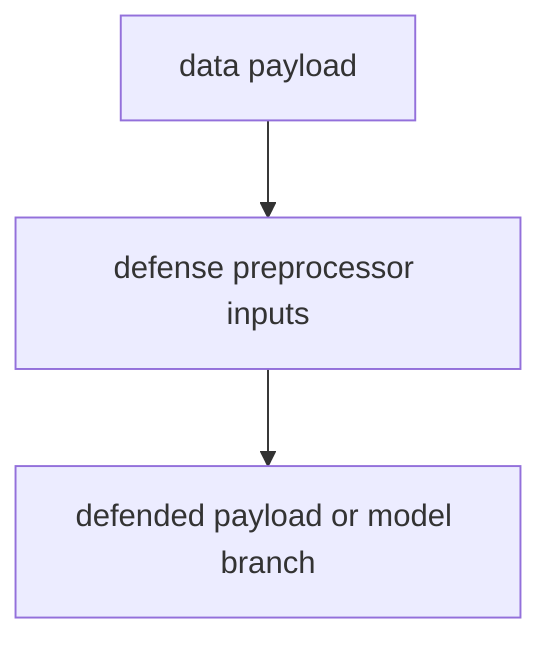
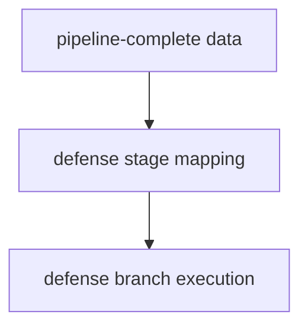
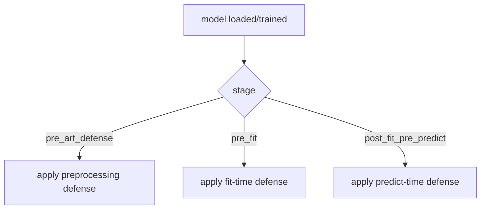
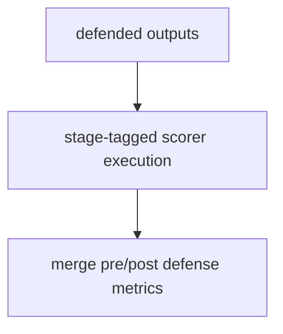
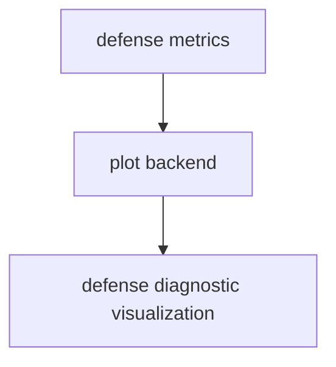

# Defense Guide for Base Config Objects

This guide summarizes defense stage semantics used by model and detector
orchestration.

For comprehensive hook ownership and policy details, see
[Plugin and Hook Execution Reference](../developers/plugin_hook_execution.md).

Related APIs:

- [Model API](../api/model)
- [Attack API](../api/attack)
- [Detector API](../api/detector)
- [Scoring API](../api/score)
- [File API](../api/file)
- [Experiment API](../api/experiment)

## Core Role

Defense behavior is stage-aware and normalized across framework/plugin wrappers,
with canonical stages such as:

- pre_art_defense
- pre_fit
- post_fit_pre_predict

## Execution Order

1. Resolve defense declarations into runtime steps.
2. Map each defense to canonical stage.
3. Apply fit-time and/or predict-time defense branch.
4. Emit stage-aware scoring outputs.
5. Persist defense-aware artifacts and metadata.

## Branching Behavior

Defense flows can branch by fit-time or predict-time application and can trigger
retraining in pretrained model paths.

## Execution Flows

### Data Flow



### Pipeline Flow



### Defense Flow



### Scoring Flow



### Plot Flow



## YAML Examples

```yaml
model:
    defense:
        pipeline:
            - name: art.defences.preprocessor.FeatureSqueezing
                apply_fit: false
                apply_predict: true
```

```yaml
model:
    defense:
        pipeline:
            - name: fairlearn.reductions.ExponentiatedGradient
                apply_fit: true
```

## Quick Checklist

- Is defense mapped to canonical stage semantics?
- Are retrain/apply_predict branches explicitly handled?
- Are defense outputs and scores persisted canonically?
