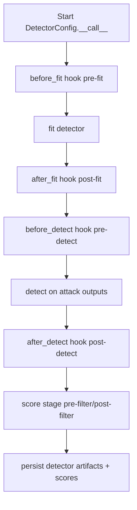
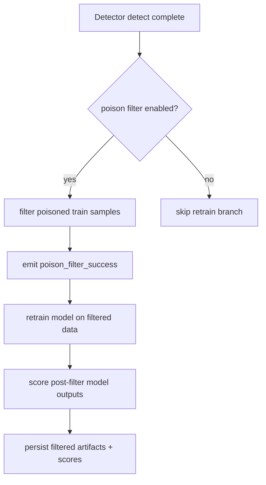
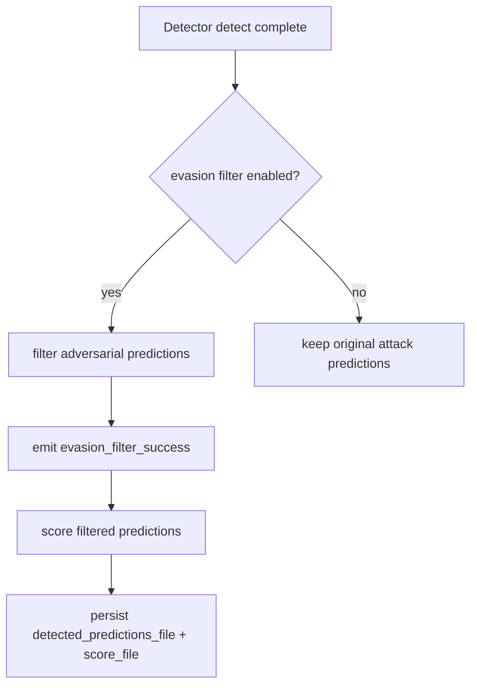

# Detector Guide for Base Config Objects

This guide documents detector runtime behavior for the base detector
configuration:

- DetectorConfig

It covers detector defaults, stage behavior, output conventions, and canonical
integration with model and attack orchestration.

Related APIs:

- [Detector API](../api/detector)
- [Attack API](../api/attack)
- [Model API](../api/model)
- [Score API](../api/score)
- [File API](../api/file)

## Core Concepts

### Detector Runtime Scope

DetectorConfig is responsible for:

- detector fit/load and detect execution
- pre/post filter stage scoring
- poisoning/evasion filter side effects
- files-only persistence and timing metadata

### Stage Semantics

Detector stages are lifecycle boundaries:

- `pre-fit` / `post-fit`
- `pre-detect` / `post-detect`
- pre-filter/post-filter scoring boundaries when filtering paths are active

## Defaults

- detector scorer defaults to detector-aware scorer config when not provided
- runtime score payloads are merged into score_dict with detector-specific keys
- detector timing keys are canonicalized for training and detection durations

## Typical Flow

At a high level, a detector run is:

1. resolve detector runtime config
2. fit detector if needed
3. detect/filter on attack outputs
4. emit detector + filter success scores
5. return/persist detector artifact and score metadata

## Execution Flows

### Flow 1: Standard Detector Fit/Detect Path

This is the baseline detector path without filter side effects. Runtime applies
stage hooks around fit and detect, then emits detector-scoped score outputs.



### Flow 2: Poisoning Filter Branch

When poisoning filtering is enabled, detector filtering feeds a retraining path
so downstream model scoring reflects cleaned training data.



### Flow 3: Evasion Filter Branch

For evasion filtering, detector post-processes attack predictions and emits
success metrics while preserving canonical score-stage semantics.



## Programmatic Example

```python
from deckard.detector import DetectorConfig

detector_cfg = DetectorConfig(
    detector_type="art.defences.detector.evasion.BinaryInputDetector",
)

scores = detector_cfg(data=my_data_cfg, model=my_model_cfg, attack=my_attack_cfg)
print(scores)
```

## YAML Example

```yaml
detector:
  _target_: deckard.detector.base.DetectorConfig
  detector_type: art.defences.detector.evasion.BinaryInputDetector
  files:
    detector_model_file: outputs/detector.pkl
    detected_predictions_file: outputs/detector_predictions.pkl
    score_file: outputs/detector_scores.json
```

## Recommended Practices

- Keep detector behavior stage-aware and side-effect explicit.
- Preserve poisoning/evasion filter success metrics in persisted scores.
- Keep detector wrapper specifics out of core orchestration.
- Persist detector outputs through canonical file aliases.

## Quick Checklist

- Are detector stages canonical and explicit?
- Are filter success metrics emitted and persisted?
- Are detector artifacts routed through files-only persistence?
- Is detector scoring merged safely into score_dict?
