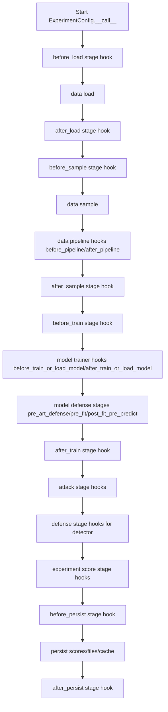
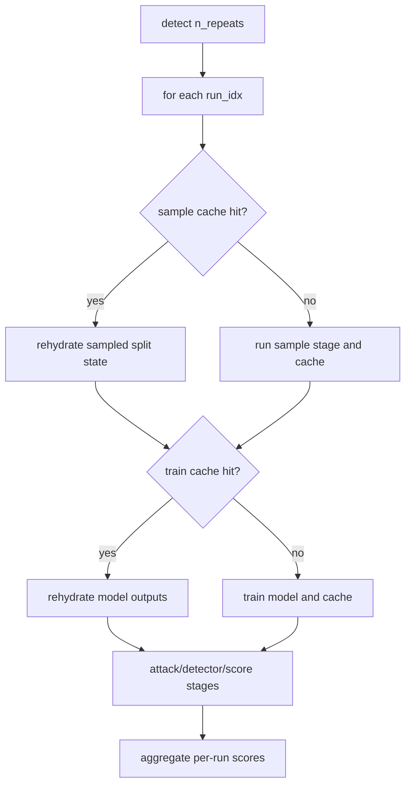
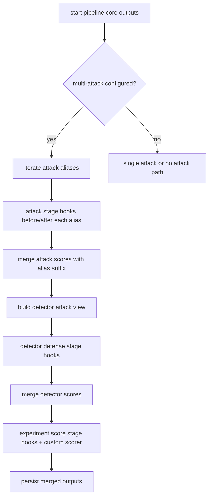

# Experiment Guide for Base Config Objects

This guide documents experiment runtime behavior for the base orchestration
configuration:

- ExperimentConfig

It covers composition of core configs, stage-aware orchestration, persistence,
and cache-aware rerun behavior.

Related APIs:

- [Experiment API](../api/experiment)
- [Data API](../api/data)
- [Model API](../api/model)
- [Attack API](../api/attack)
- [Detector API](../api/detector)
- [Score API](../api/score)
- [File API](../api/file)

## Core Concepts

### Canonical Runtime Buckets

ExperimentConfig maintains canonical runtime state:

- files: runtime artifact aliases and persistence targets
- times: canonical timing keys plus optional extensions
- score_dict: merged experiment score payload
- outputs: runtime outputs, hook graph traces, and cache metadata
- params: resolved manifest for reproducibility and cache keys

### Stage-Oriented Composition

Experiment orchestration composes data/model/attack/detector/scoring through
canonical stages:

- load
- sample
- train
- defense
- attack
- score
- persist

Stage hooks are generated programmatically from canon definitions and executed
through HookPlugin/HookBundle composition.

## Defaults

- evaluation_mode defaults to `standard`
- score_mode can override split-scoped scoring behavior
- files-only persistence is enforced via FileConfig
- runtime cache uses stage keys derived from params + stage identity

## Typical Flow

At a high level, an experiment run is:

1. resolve/normalize component configs
2. load data and prepare runtime split(s)
3. train model, apply defense, run attacks/detector
4. run experiment-level scorers
5. persist merged score payload and runtime cache metadata

## Execution Flows

### Flow 1: Single-Pass Standard Orchestration

This path executes one end-to-end run through canonical stages and stage hooks,
then persists merged score output and runtime metadata. Pipeline hooks are
executed inside DataConfig, trainer hooks are executed inside ModelConfig, and
defense hooks run both in model-defense stages and in the experiment-level
detector defense stage.



### Flow 2: Repeated Split/Fold with Cache Reuse

For k-fold or shuffle split runs, each run index can reuse cached stage outputs
when params and stage identity match; otherwise the stage executes and rewrites
cache entries.



### Flow 3: Multi-Attack + Detector + Stage-Scoped Scoring

When multiple attacks are configured, ExperimentConfig runs each attack branch,
suffixes colliding score keys by alias, optionally applies detector filtering,
and then executes experiment-level scorers. The detector branch is where the
experiment-level `defense` stage hooks are emitted.



## Programmatic Example

```python
from deckard.experiment import ExperimentConfig

cfg = ExperimentConfig(
    data=my_data_cfg,
    model=my_model_cfg,
    attack=my_attack_cfg,
    detector=my_detector_cfg,
    files={"score_file": "outputs/experiment_scores.json"},
)

scores = cfg()
print(scores)
```

## YAML Example

```yaml
experiment:
  _target_: deckard.experiment.base.ExperimentConfig
  evaluation_mode: standard
  data: ${data}
  model: ${model}
  attack: ${attack}
  detector: ${detector}
  files:
    score_file: outputs/experiment_scores.json
    params_file: outputs/experiment_params.yaml
```

## Recommended Practices

- Use canonical component configs and avoid alternate orchestration paths.
- Keep stage behavior explicit and hook-driven.
- Persist params and scores for cache-aware reruns and trial reuse.
- Use deterministic bundle ordering for repeatable hook composition.

## Quick Checklist

- Are all runtime components composed through ExperimentConfig?
- Are stage hooks and cache metadata captured in outputs?
- Are scores and params persisted through files-only aliases?
- Are split/trial reruns stable under unchanged params?
