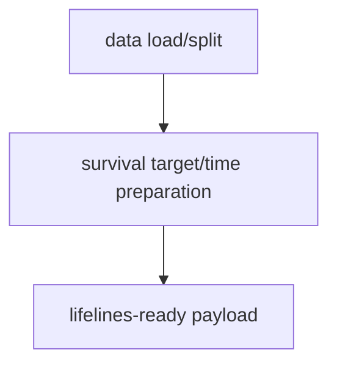
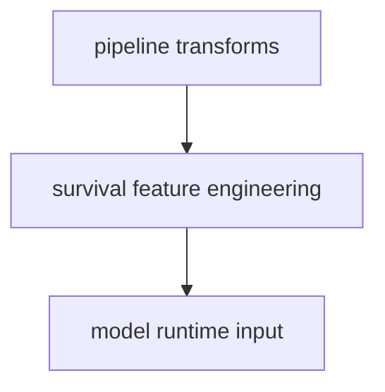
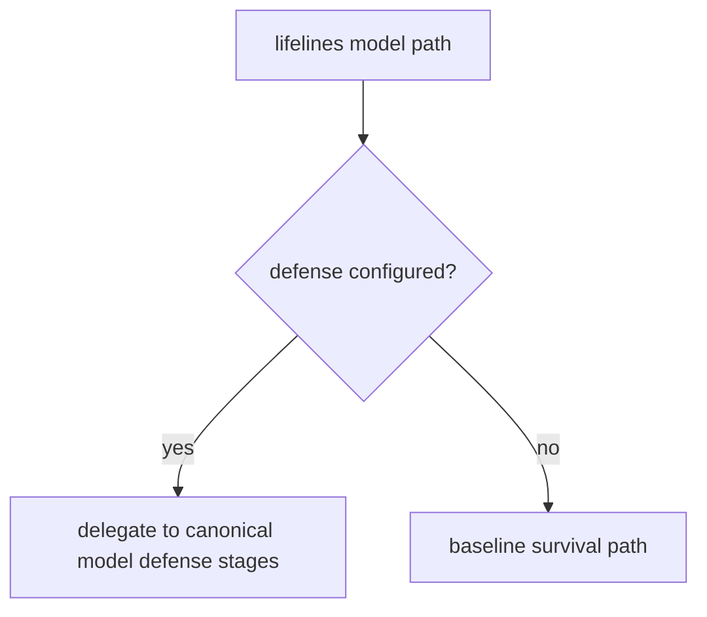
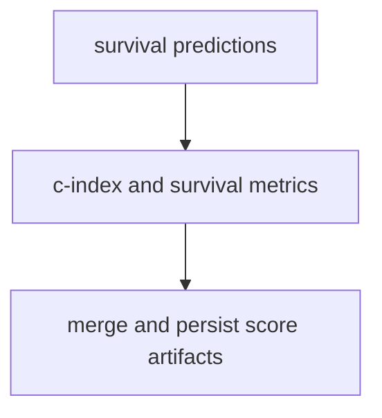
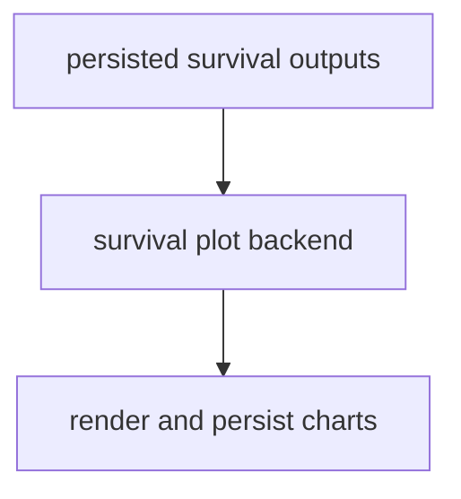

# Lifelines Plugin Overview

This overview focuses on Lifelines execution order.

For comprehensive hook ownership and policy details, see
[Plugin and Hook Execution Reference](../../developers/hooks.md).

Related docs:

- [Data API](../../api/data)
- [Pipeline API](../../api/pipeline)
- [Model API](../../api/model)
- [Defense API](../../api/defend)
- [Scoring Overview](../scoring.md)
- [File API](../../api/file)
- [Artifacts API](../../api/artifacts)
- [Experiment Guide](../experiment.md)
- [Plot API](../../api/plot)

## Execution Order

1. Survival-oriented data preparation and optional pipeline transforms.
2. Lifelines model runtime execution.
3. Defense branch delegation (if configured in model).
4. Survival scoring execution.
5. Survival plot rendering and persistence.

## Execution Flows

### Data Flow



### Pipeline Flow



### Defense Flow



### Scoring Flow



### Plot Flow



## YAML Examples

```yaml
model:
        _target_: deckard.plugins.lifelines.model.SurvivalModelConfig

score:
    model:
        scorers:
            c_index:
                score_function: lifelines.utils.concordance_index
```
