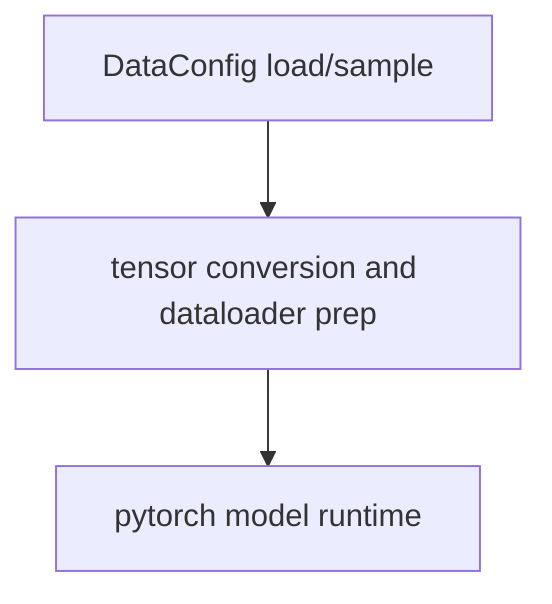
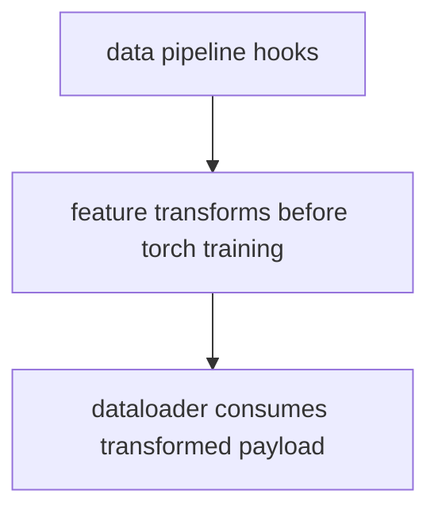
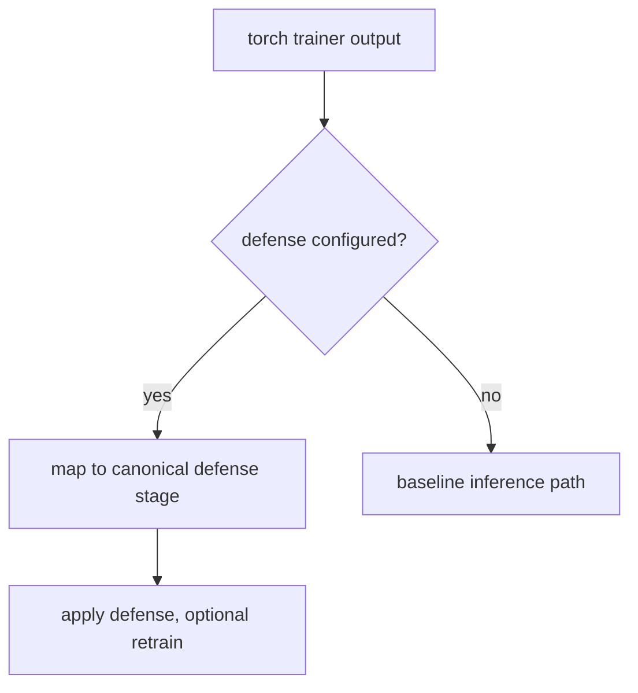
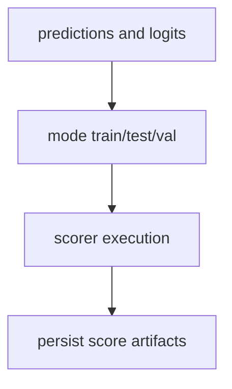
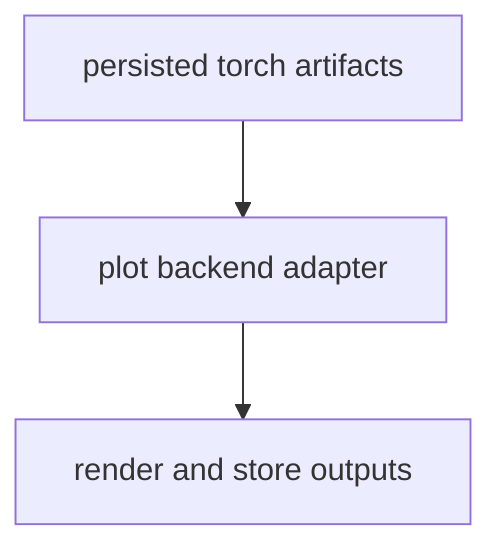

# PyTorch Framework Overview

This overview focuses on execution order for PyTorch framework wrappers.

For comprehensive hook ownership and policy details, see
[Plugin and Hook Execution Reference](../../developers/hooks).

Related docs:

- [Data API](../../api/data)
- [Pipeline API](../../api/pipeline)
- [Model API](../../api/model)
- [Training API](../../api/train)
- [Defense API](../../api/defend)
- [Attack API](../../api/attack)
- [Detector API](../../api/detector)
- [Scoring Overview](../scoring)
- [File API](../../api/file)
- [Artifacts API](../../api/artifacts)
- [Experiment Guide](../experiment)
- [Plot API](../../api/plot)

## Execution Order

1. Data tensors/dataloader payload preparation.
2. PyTorch trainer execution (fit/load strategy).
3. Defense stage mapping and application.
4. Mode/stage scoring and score merge.
5. Checkpoint/artifact persistence and plot consumption.

## Execution Flows

### Data Flow



### Pipeline Flow



### Defense Flow



### Scoring Flow



### Plot Flow



## YAML Examples

```yaml
model:
    _target_: deckard.frameworks.pytorch.model.PytorchModelConfig
    trainer:
        _target_: deckard.model.trainer.base.PytorchTrainerConfig
    model_params:
        epochs: 3
        lr: 0.001
```

```yaml
score:
    model:
        scorers:
            accuracy:
                score_name: accuracy
                score_function: sklearn.metrics.accuracy_score
```
