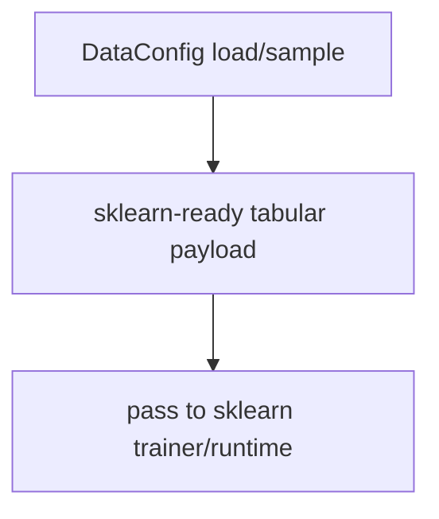
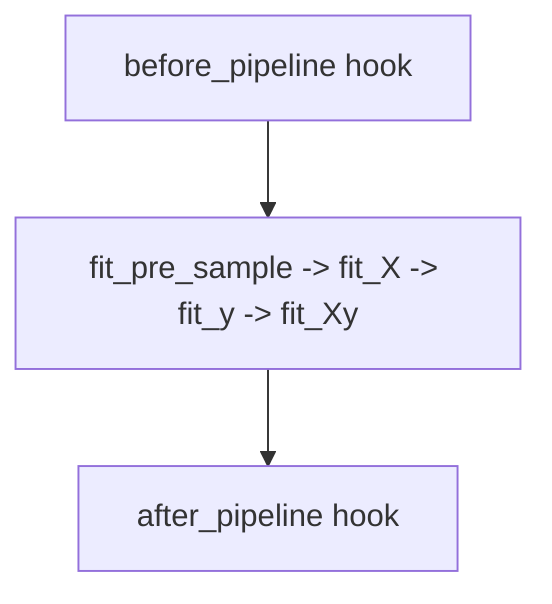
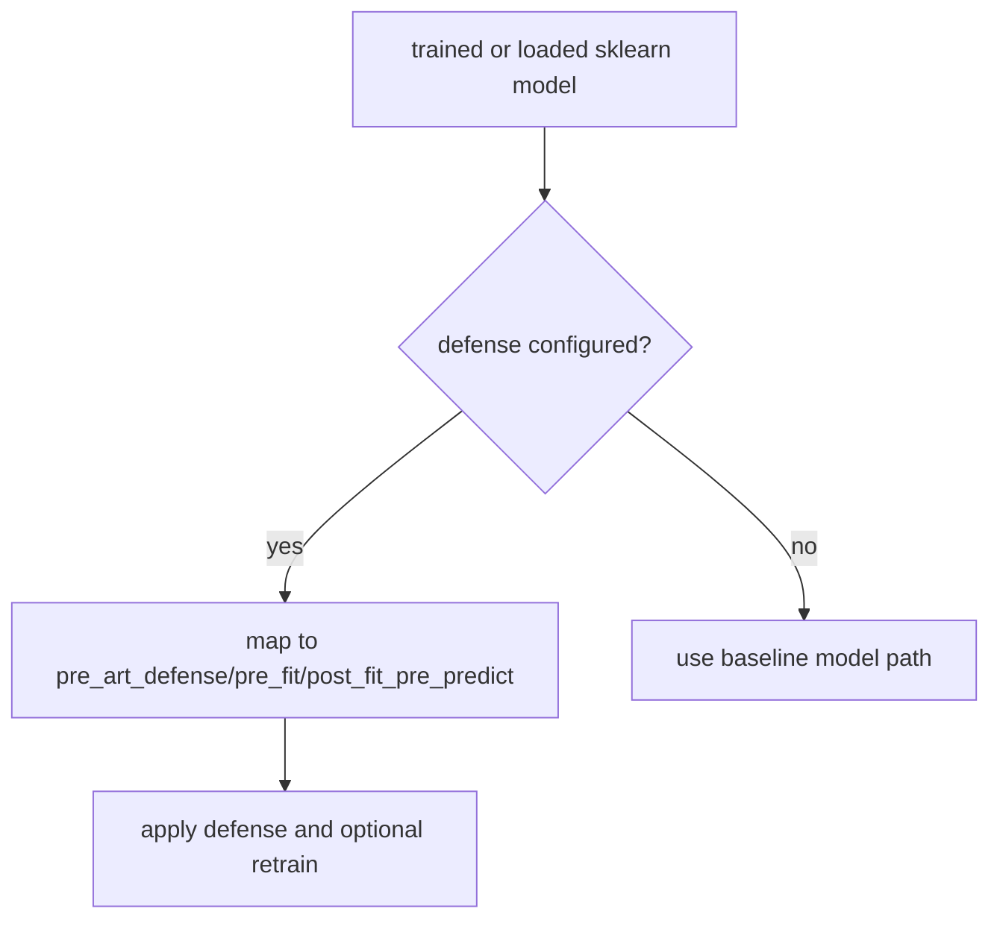
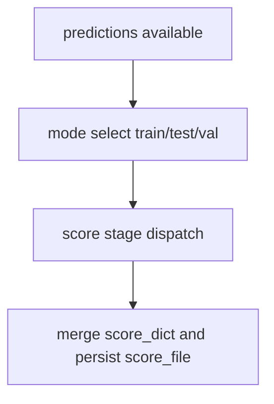
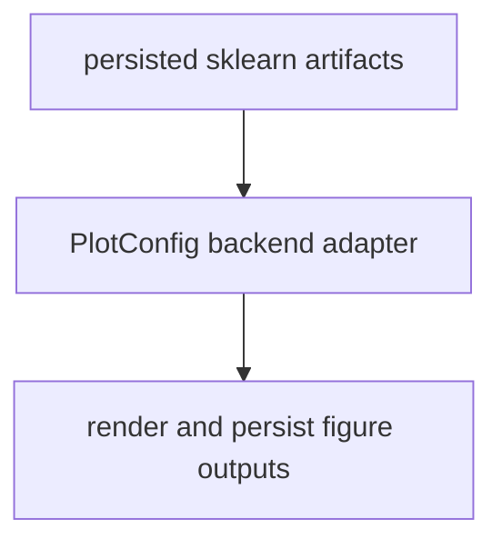

# sklearn Framework Overview

This overview focuses on execution order for sklearn framework wrappers.

For comprehensive hook ownership and policy details, see
[Plugin and Hook Execution Reference](../../developers/hooks.md).

Related docs:

- [Data API](../../api/data)
- [Pipeline API](../../api/pipeline)
- [Model API](../../api/model)
- [Training API](../../api/train)
- [Defense API](../../api/defend)
- [Attack API](../../api/attack)
- [Detector API](../../api/detector)
- [Scoring Overview](../scoring.md)
- [File API](../../api/file)
- [Artifacts API](../../api/artifacts)
- [Experiment Guide](../experiment.md)
- [Plot API](../../api/plot)
- [Utils API](../../api/utils)

## Execution Order

1. Data split and optional pipeline transform execution.
2. Model trainer strategy resolution and training/load path.
3. Defense stage mapping and application.
4. Split-scoped scoring and score merge.
5. Artifact/file persistence and optional downstream plotting.

## Execution Flows

### Data Flow



### Pipeline Flow



### Defense Flow



### Scoring Flow



### Plot Flow



## YAML Examples

```yaml
data:
    _target_: deckard.data.base.DataConfig
    pipeline:
        scale:
            name: sklearn.preprocessing.StandardScaler
            fit_X: true

model:
    _target_: deckard.model.base.ModelConfig
    model_type: sklearn.ensemble.RandomForestClassifier
    trainer:
        _target_: deckard.model.trainer.base.SklearnTrainerConfig
```

```yaml
score:
    model:
        scorers:
            accuracy:
                score_name: accuracy
                score_function: sklearn.metrics.accuracy_score
```