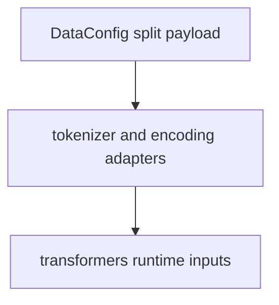
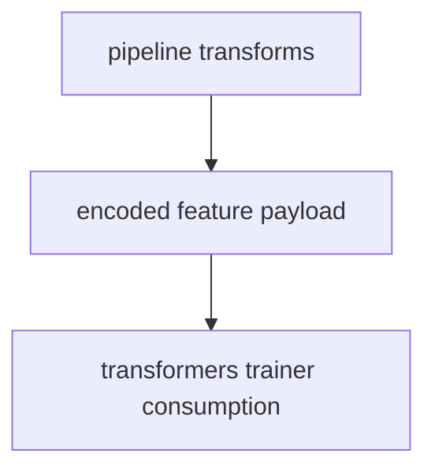
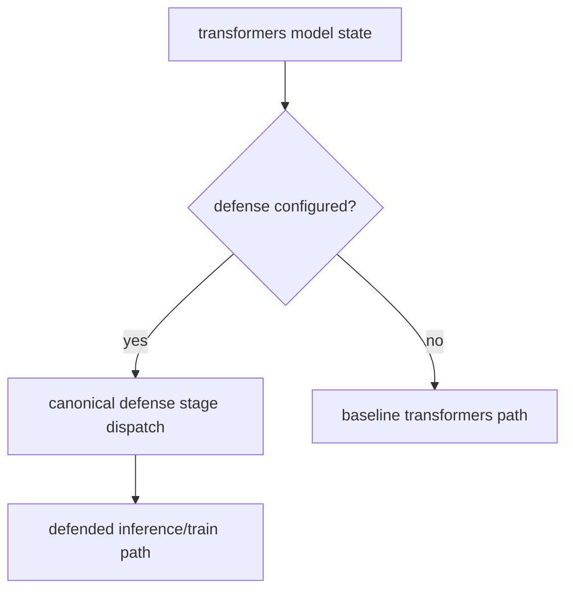
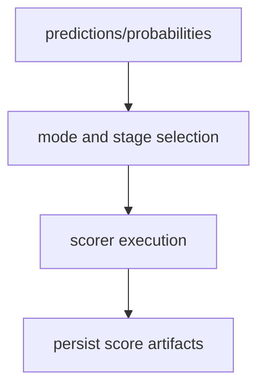
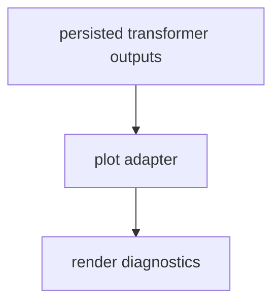

# Transformers Framework Overview

This overview focuses on execution order for transformers framework wrappers.

For comprehensive hook ownership and policy details, see
[Plugin and Hook Execution Reference](../../developers/hooks.md).

Related docs:

- [Data API](../../api/data)
- [Pipeline API](../../api/pipeline)
- [Model API](../../api/model)
- [Training API](../../api/train)
- [Defense API](../../api/defend)
- [Attack API](../../api/attack)
- [Scoring Overview](../scoring.md)
- [File API](../../api/file)
- [Artifacts API](../../api/artifacts)
- [Experiment Guide](../experiment.md)
- [Plot API](../../api/plot)

## Execution Order

1. Data split and tokenizer/encoding preparation.
2. Transformer wrapper and trainer strategy execution.
3. Defense stage mapping where configured.
4. Split/stage scoring and score merge.
5. Artifact persistence and optional plotting.

## Execution Flows

### Data Flow



### Pipeline Flow



### Defense Flow



### Scoring Flow



### Plot Flow



## YAML Examples

```yaml
model:
    _target_: deckard.frameworks.transformers.model.TransformersModelConfig
    model_type: transformers.AutoModelForSequenceClassification
    tokenizer: transformers.AutoTokenizer
```

```yaml
score:
    model:
        scorers:
            f1:
                score_name: f1
                score_function: sklearn.metrics.f1_score
                score_params:
                    average: weighted
```
