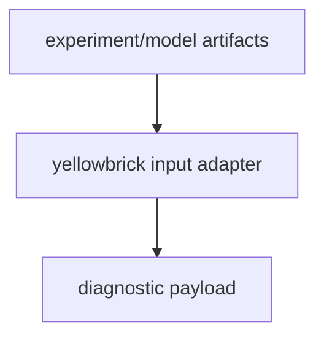
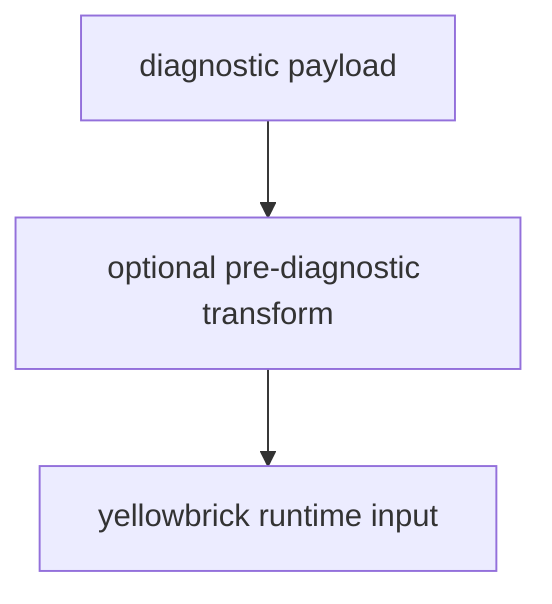
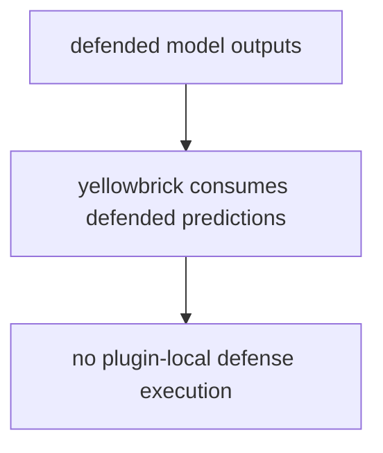
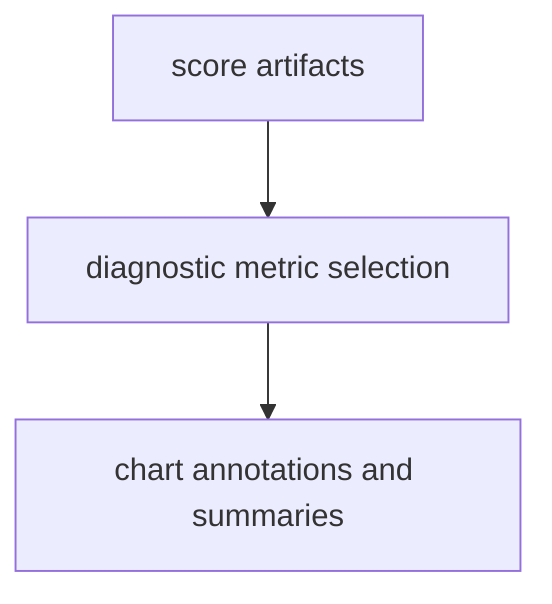
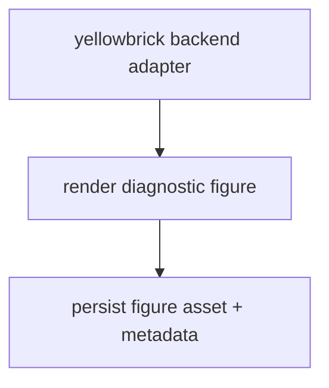

# Yellowbrick Plugin Overview

This overview focuses on Yellowbrick plugin execution order.

For comprehensive hook ownership and policy details, see
[Plugin and Hook Execution Reference](../../developers/hooks.md).

Related docs:

- [Data API](../../api/data)
- [Pipeline API](../../api/pipeline)
- [Model API](../../api/model)
- [Defense API](../../api/defend)
- [Scoring Overview](../scoring.md)
- [File API](../../api/file)
- [Artifacts API](../../api/artifacts)
- [Experiment Guide](../experiment.md)
- [Plot API](../../api/plot)

## Execution Order

1. Read model/experiment artifacts from canonical outputs.
2. Apply optional pre-diagnostic data preparation.
3. Use defense-aware model outputs from source runtimes.
4. Consume scorer outputs and diagnostic targets.
5. Render yellowbrick diagnostics and persist plot artifacts.

## Execution Flows

### Data Flow



### Pipeline Flow



### Defense Flow



### Scoring Flow



### Plot Flow



## YAML Examples

```yaml
plot:
  _target_: deckard.plugins.yellowbrick.plot.YellowbrickPlotConfig
  files:
    plot_file: outputs/yellowbrick_diagnostic.png
```