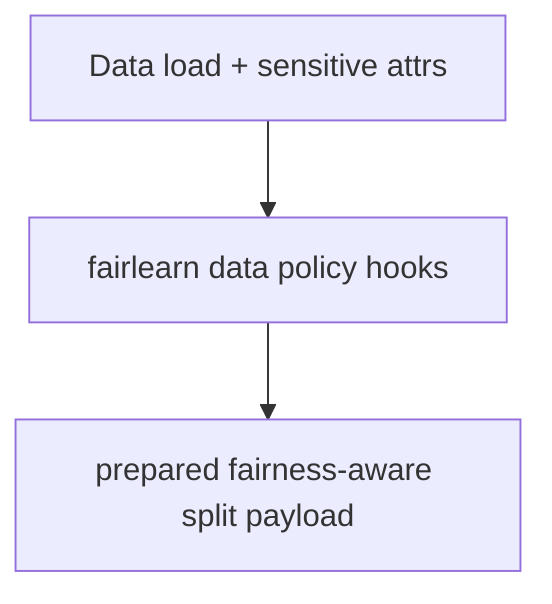
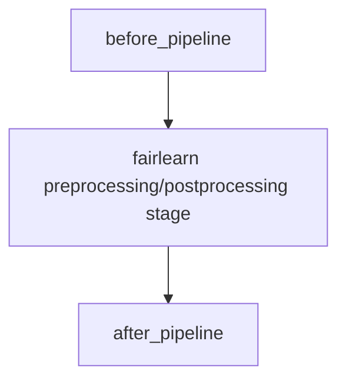
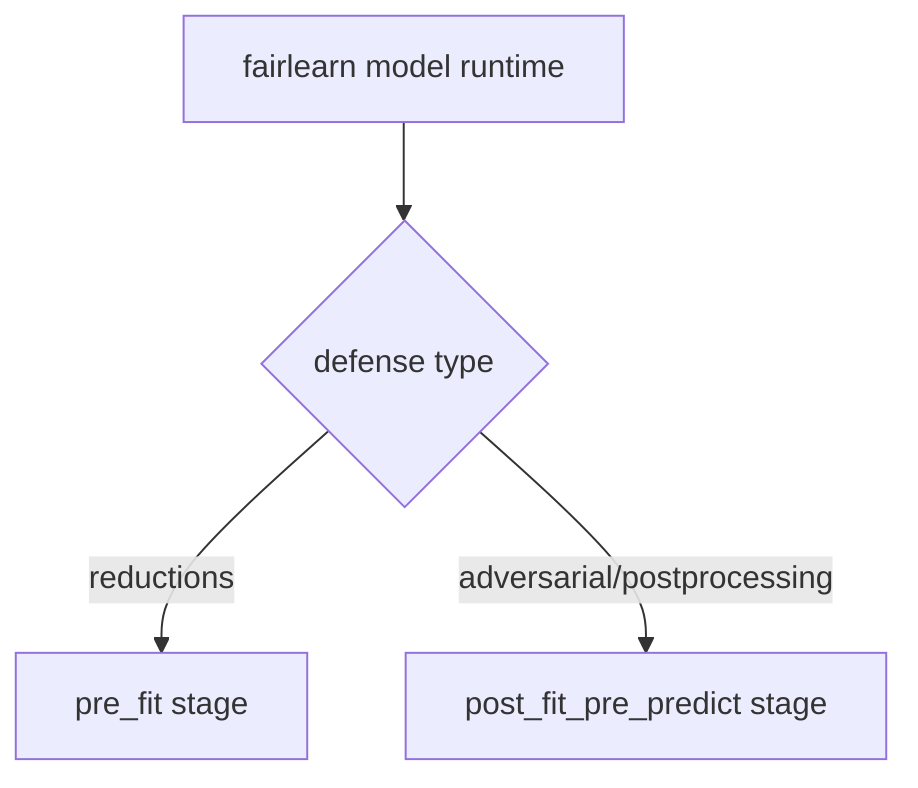
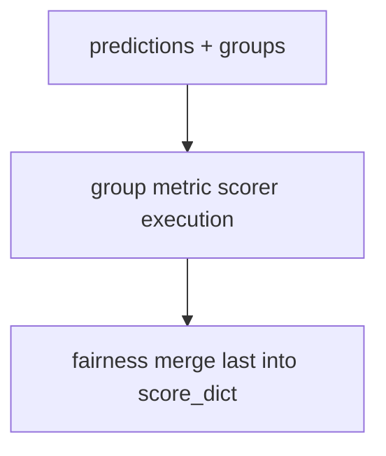
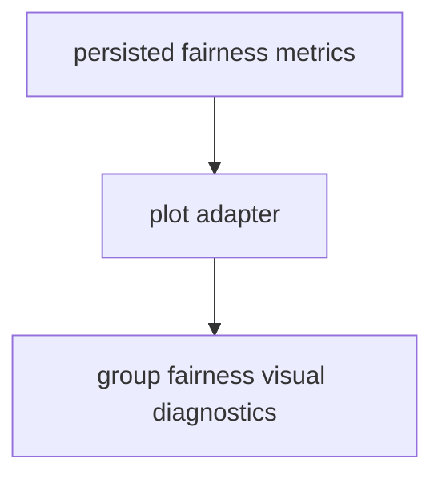

# Fairlearn Plugin Overview

This overview focuses on Fairlearn execution order.

For comprehensive hook ownership and policy details, see
[Plugin and Hook Execution Reference](../developers/plugin_hook_execution.md).

Related docs:

- [Data Guide](data.md)
- [Pipeline Guide](pipeline.md)
- [Model Guide](model.md)
- [Trainer Guide](trainer.md)
- [Defense Guide](defense.md)
- [Detector Guide](detector.md)
- [Scoring Guide](scoring.md)
- [Files Guide](file.md)
- [Artifacts Guide](artifacts.md)
- [Experiment Guide](experiment.md)
- [Plot Guide](plot.md)

## Execution Order

1. Sensitive-feature-aware data and pipeline handling.
2. Fairness-aware trainer/model wrapper execution.
3. Defense stage mapping for fairness policy branches.
4. Group fairness scoring merge.
5. Canonical persistence and fairness diagnostics.

## Execution Flows

### Data Flow



### Pipeline Flow



### Defense Flow



### Scoring Flow



### Plot Flow



## YAML Examples

```yaml
data:
    _target_: deckard.plugins.fairlearn.data.FairlearnDataConfig
    sensitive_columns: [sex]

model:
    _target_: deckard.plugins.fairlearn.model.FairlearnModelConfig
```

```yaml
score:
    model:
        _target_: deckard.plugins.fairlearn.score.FairlearnScoreDictConfig
        group_reduction: difference
```
