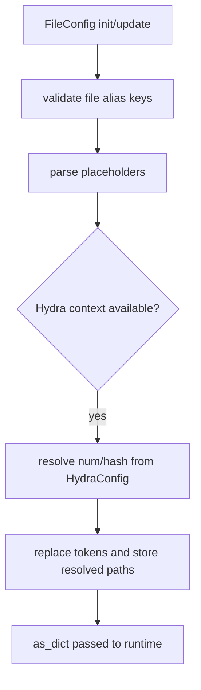
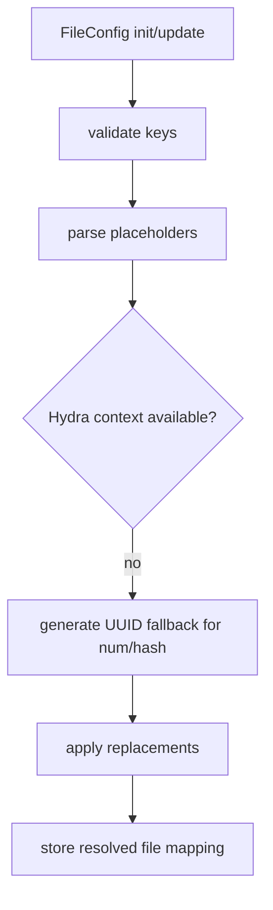
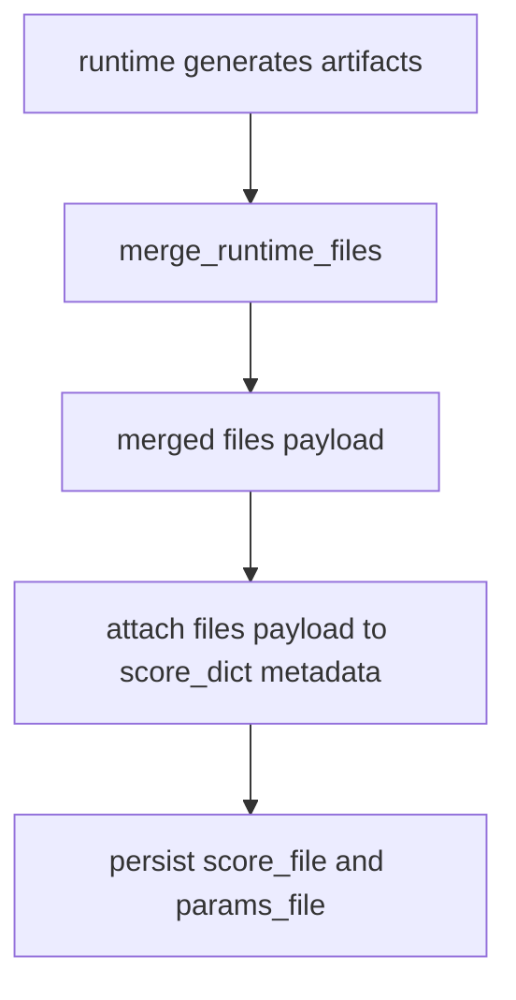

# File Guide for Base Config Objects

This guide documents the canonical file registry and placeholder behavior used
across Deckard runtimes.

Primary object:

- FileConfig

It covers allowed file aliases, placeholder resolution, validation behavior,
and persistence expectations.

Related APIs:

- [File API](../api/file)
- [Data API](../api/data)
- [Model API](../api/model)
- [Attack API](../api/attack)
- [Detector API](../api/detector)
- [Experiment API](../api/experiment)

## Core Concepts

### FileConfig as Canonical Registry

FileConfig is the public typed registry for runtime artifacts.
It validates keys against canonical schema aliases and stores resolved paths.

### Placeholder Resolution

Supported placeholders include:

- `{num}` and `{#}` for multirun job number
- `{hash}` and `{*}` for stable runtime identity
- `{timestamp}` for time-based suffixing
- user-provided replacements via replace mapping

Hydra-aware values are used when available; UUID fallbacks are used otherwise.

### Handler Abstraction

File validation and template replacement are implemented through a shared handler
contract so runtimes can use consistent key checks and resolution behavior.

## Typical Flow

At a high level, FileConfig usage is:

1. define file alias keys in config
2. validate and resolve placeholders
3. pass resolved mapping into runtime call paths
4. persist and merge runtime output aliases back into score metadata

## Execution Flows

### Flow 1: Hydra-Aware Placeholder Resolution

With Hydra job context available, FileConfig resolves `{num}` and `{hash}` from
job metadata and returns deterministic sweep-safe artifact paths.



### Flow 2: Non-Hydra Fallback Resolution

Without Hydra, FileConfig falls back to UUID-derived identifiers so output paths
remain collision-safe in local runs.



### Flow 3: Runtime Merge-Back Path

At runtime completion, core configs merge updated file aliases back into score
metadata. FileConfig itself has no score hooks; hook/scoring stages are handled
by caller runtimes that consume this registry.



## Programmatic Example

```python
from deckard.file import FileConfig

files = FileConfig(
    score_file="outputs/{hash}/scores_{num}.json",
    model_file="outputs/{hash}/model.pkl",
)

print(files.as_dict())
```

## YAML Example

```yaml
files:
  _target_: deckard.file.FileConfig
  score_file: outputs/{hash}/scores_{num}.json
  model_file: outputs/{hash}/model.pkl
  attack_file: outputs/{hash}/attack.pkl
```

## Recommended Practices

- Use canonical file alias keys only.
- Keep persistence file-driven and avoid ad hoc path kwargs.
- Include params/score aliases for reproducible rerun workflows.
- Use placeholders for sweep-safe and collision-safe outputs.

## Quick Checklist

- Are all file keys valid canonical aliases?
- Are placeholders deterministic for run/multirun usage?
- Are runtime outputs merged back into files metadata?
- Are score/params artifacts explicitly configured?
