# Default Workflow Flowchart

This page shows the default Deckard workflow as one high-level orchestration
diagram.

Shared semantic color system:

- Data -> green
- Model -> blue
- Attack -> red
- Detector -> purple
- Files -> light gray
- Scores -> orange
- Experiment -> dark gray
- Visualization -> dark gray

## Default Workflow

Canonical orchestration entrypoint: {meth}`deckard.experiment.ExperimentConfig.run`.

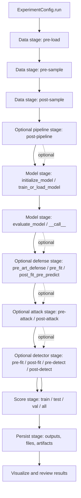

## Reading Guide

- The default path is `load -> sample -> train -> defense -> attack -> detector -> score -> persist`.
- Attack sits after the model has produced baseline outputs so you can compare
  clean and attacked results.
- Detector and scoring come after the attack path, and persistence is followed
  by visualization and review.

## Core API Flowcharts

The flowcharts below are the canonical source for the core object diagrams used
in [Core Modules](core).

### Data API Overview

<!-- core-data-overview-start -->
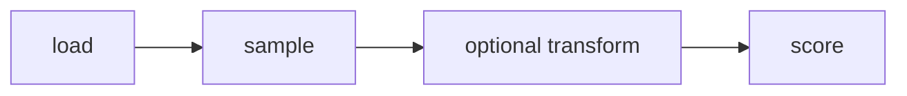
<!-- core-data-overview-end -->

### Model API Overview

<!-- core-model-overview-start -->
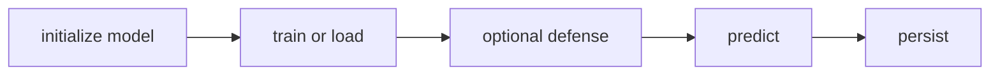
<!-- core-model-overview-end -->

### Model Trainer Scope

<!-- core-model-trainer-scope-start -->
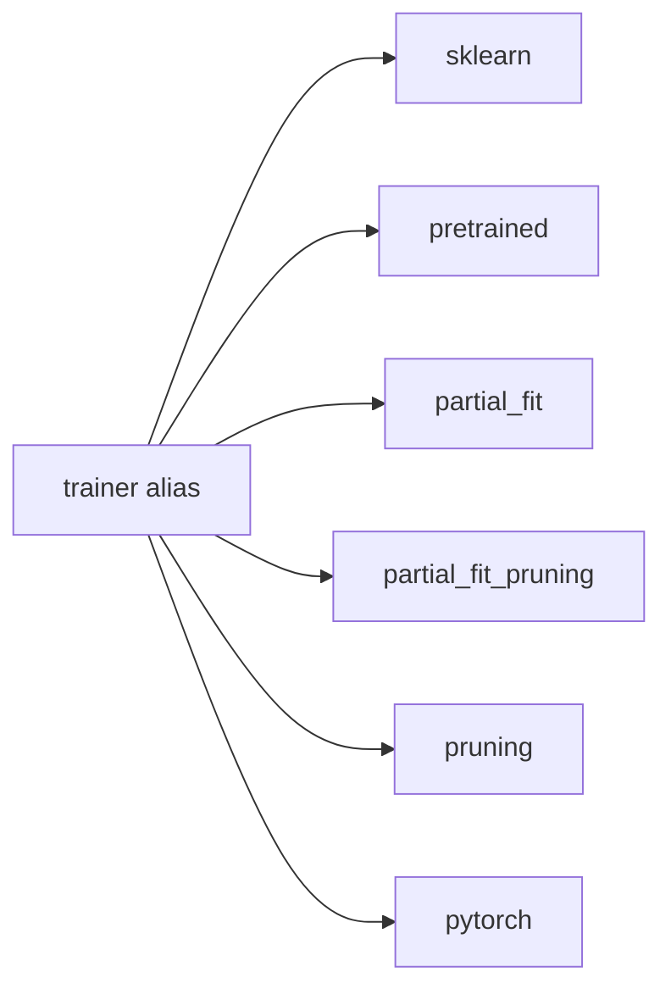
<!-- core-model-trainer-scope-end -->

### Defense Subtypes

<!-- core-defense-subtypes-start -->
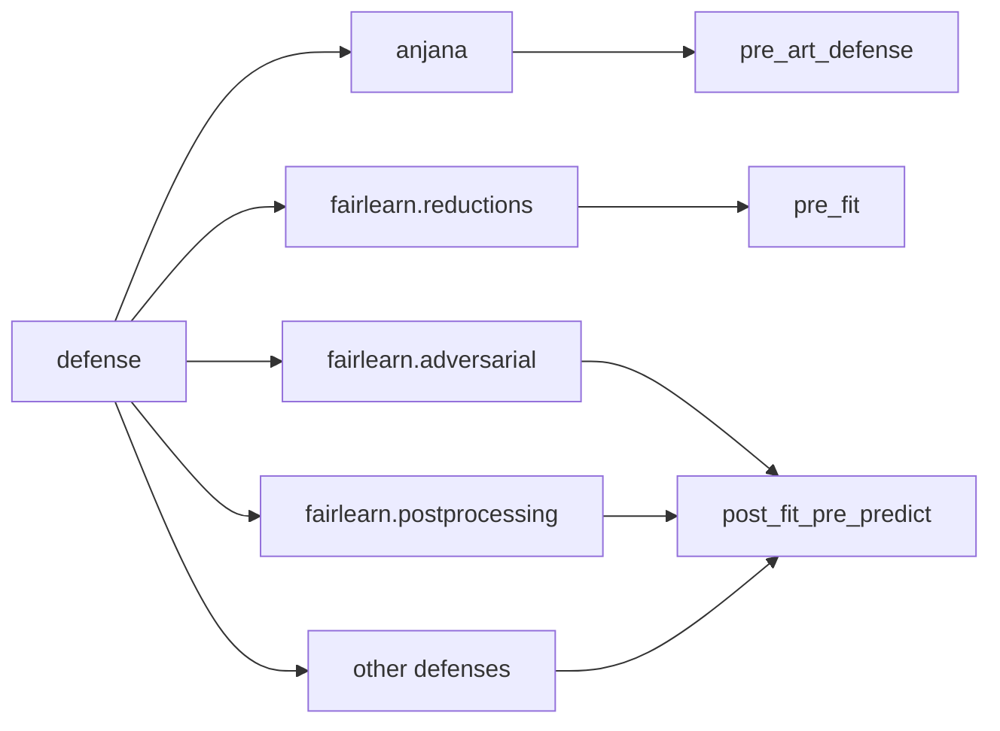
<!-- core-defense-subtypes-end -->

### Attack API Overview

<!-- core-attack-overview-start -->
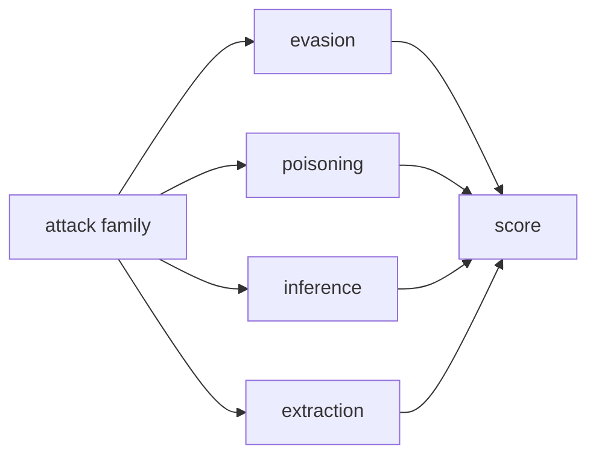
<!-- core-attack-overview-end -->

### Detector API Overview

<!-- core-detector-overview-start -->
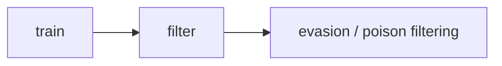
<!-- core-detector-overview-end -->

### Score API Overview

<!-- core-score-overview-start -->
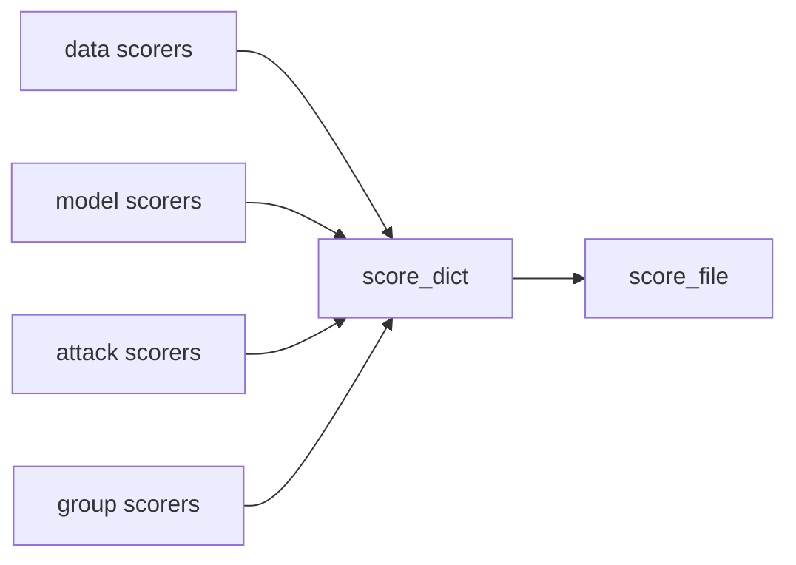
<!-- core-score-overview-end -->

### Experiment API Overview

<!-- core-experiment-overview-start -->
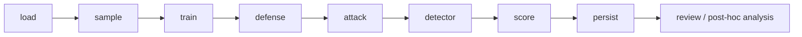
<!-- core-experiment-overview-end -->

### Persistence API Overview

<!-- core-persistence-overview-start -->
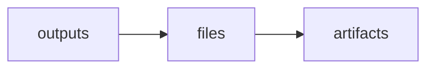
<!-- core-persistence-overview-end -->

## Core API Scoping Flowcharts

The charts below focus on how each core object scopes its smaller pieces.

### Data API

<!-- core-data-scope-start -->
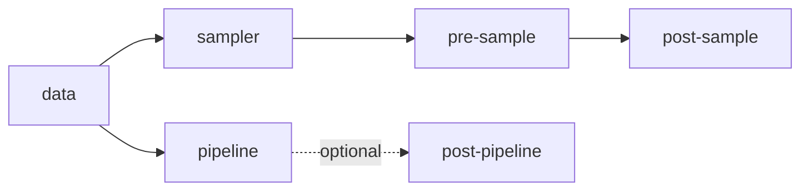
<!-- core-data-scope-end -->

### Data Runtime Flow

<!-- core-data-flowchart-start -->
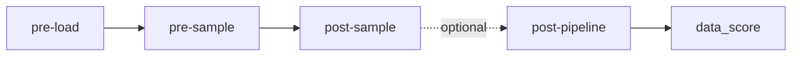
<!-- core-data-flowchart-end -->

### Model API

<!-- core-model-scope-start -->
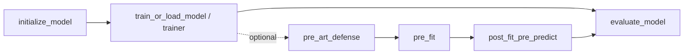
<!-- core-model-scope-end -->

### Model Runtime Flow

<!-- core-model-flowchart-start -->
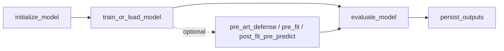
<!-- core-model-flowchart-end -->

### Attack API

<!-- core-attack-family-start -->
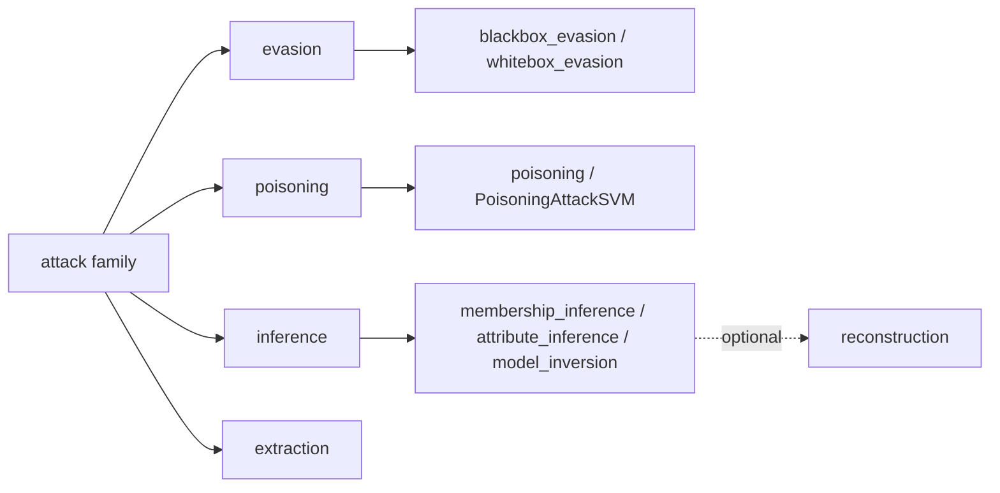
<!-- core-attack-family-end -->

### Attack Runtime Flow

<!-- core-attack-flowchart-start -->

<!-- core-attack-flowchart-end -->

### Experiment API

<!-- core-experiment-flowchart-start -->
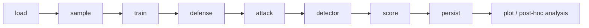
<!-- core-experiment-flowchart-end -->

### Persistence API

<!-- core-persistence-flowchart-start -->
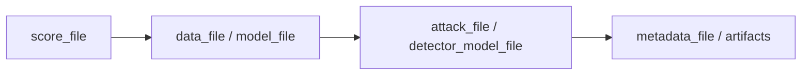
<!-- core-persistence-flowchart-end -->

### Detector API

<!-- core-detector-mode-start -->
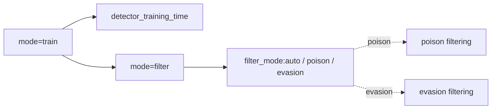
<!-- core-detector-mode-end -->

### Score API

<!-- core-score-composition-start -->
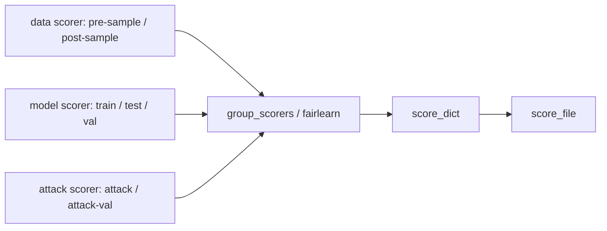
<!-- core-score-composition-end -->

## Extension Flowcharts

### ANJANA Execution Flows

<!-- anjana-execution-flows-start -->
## Execution Flows

### Data Flow

```mermaid
flowchart TD
    A[Data load] --> B[before_sample privacy hook execution]
    B --> C[sampled privacy-aware payload]
```

### Pipeline Flow

```mermaid
flowchart TD
    A[privacy-constrained input] --> B[pipeline stages]
    B --> C[policy-compliant transformed payload]
```

### Defense Flow

```mermaid
flowchart TD
    A[model runtime with ANJANA] --> B[map defense to pre_art_defense]
    B --> C[apply defense path]
```

### Scoring Flow

```mermaid
flowchart TD
    A[privacy run outputs] --> B[anjana scorer execution]
    B --> C[merge privacy metrics into score_dict]
```

### Plot Flow

```mermaid
flowchart TD
    A[persisted privacy metrics/artifacts] --> B[plot adapter]
    B --> C[render privacy diagnostics]
```
<!-- anjana-execution-flows-end -->

### sklearn Execution Flows

<!-- sklearn-execution-flows-start -->
## Execution Flows

### Data Flow

```mermaid
flowchart TD
  A[DataConfig load/sample] --> B[sklearn-ready tabular payload]
  B --> C[pass to sklearn trainer/runtime]
```

### Pipeline Flow

```mermaid
flowchart TD
  A[before_pipeline hook] --> B[fit_pre_sample -> fit_X -> fit_y -> fit_Xy]
  B --> C[after_pipeline hook]
```

### Defense Flow

```mermaid
flowchart TD
  A[trained or loaded sklearn model] --> B{defense configured?}
  B -- yes --> C[map to pre_art_defense/pre_fit/post_fit_pre_predict]
  C --> D[apply defense and optional retrain]
  B -- no --> E[use baseline model path]
```

### Scoring Flow

```mermaid
flowchart TD
  A[predictions available] --> B[mode select train/test/val]
  B --> C[score stage dispatch]
  C --> D[merge score_dict and persist score_file]
```

### Plot Flow

```mermaid
flowchart TD
  A[persisted sklearn artifacts] --> B[PlotConfig backend adapter]
  B --> C[render and persist figure outputs]
```
<!-- sklearn-execution-flows-end -->

### Fairlearn Execution Flows

<!-- fairlearn-execution-flows-start -->
## Execution Flows

### Data Flow

```mermaid
flowchart TD
  A[Data load + sensitive attrs] --> B[fairlearn data policy hooks]
  B --> C[prepared fairness-aware split payload]
```

### Pipeline Flow

```mermaid
flowchart TD
  A[before_pipeline] --> B[fairlearn preprocessing/postprocessing stage]
  B --> C[after_pipeline]
```

### Defense Flow

```mermaid
flowchart TD
  A[fairlearn model runtime] --> B{defense type}
  B -- reductions --> C[pre_fit stage]
  B -- adversarial/postprocessing --> D[post_fit_pre_predict stage]
```

### Scoring Flow

```mermaid
flowchart TD
  A[predictions + groups] --> B[group metric scorer execution]
  B --> C[fairness merge last into score_dict]
```

### Plot Flow

```mermaid
flowchart TD
  A[persisted fairness metrics] --> B[plot adapter]
  B --> C[group fairness visual diagnostics]
```
<!-- fairlearn-execution-flows-end -->

### PyTorch Execution Flows

<!-- pytorch-execution-flows-start -->
## Execution Flows

### Data Flow

```mermaid
flowchart TD
  A[DataConfig load/sample] --> B[tensor conversion and dataloader prep]
  B --> C[pytorch model runtime]
```

### Pipeline Flow

```mermaid
flowchart TD
  A[data pipeline hooks] --> B[feature transforms before torch training]
  B --> C[dataloader consumes transformed payload]
```

### Defense Flow

```mermaid
flowchart TD
  A[torch trainer output] --> B{defense configured?}
  B -- yes --> C[map to canonical defense stage]
  C --> D[apply defense, optional retrain]
  B -- no --> E[baseline inference path]
```

### Scoring Flow

```mermaid
flowchart TD
  A[predictions and logits] --> B[mode train/test/val]
  B --> C[scorer execution]
  C --> D[persist score artifacts]
```

### Plot Flow

```mermaid
flowchart TD
  A[persisted torch artifacts] --> B[plot backend adapter]
  B --> C[render and store outputs]
```
<!-- pytorch-execution-flows-end -->

### Lifelines Execution Flows

<!-- lifelines-execution-flows-start -->
## Execution Flows

### Data Flow

```mermaid
flowchart TD
  A[data load/split] --> B[survival target/time preparation]
  B --> C[lifelines-ready payload]
```

### Pipeline Flow

```mermaid
flowchart TD
  A[pipeline transforms] --> B[survival feature engineering]
  B --> C[model runtime input]
```

### Defense Flow

```mermaid
flowchart TD
  A[lifelines model path] --> B{defense configured?}
  B -- yes --> C[delegate to canonical model defense stages]
  B -- no --> D[baseline survival path]
```

### Scoring Flow

```mermaid
flowchart TD
  A[survival predictions] --> B[c-index and survival metrics]
  B --> C[merge and persist score artifacts]
```

### Plot Flow

```mermaid
flowchart TD
  A[persisted survival outputs] --> B[survival plot backend]
  B --> C[render and persist charts]
```
<!-- lifelines-execution-flows-end -->

### Seaborn Execution Flows

<!-- seaborn-execution-flows-start -->
## Execution Flows

### Data Flow

```mermaid
flowchart TD
    A[data or experiment artifact input] --> B[seaborn data adapter]
    B --> C[plot-ready dataframe payload]
```

### Pipeline Flow

```mermaid
flowchart TD
    A[plot input payload] --> B[optional pre-plot transform]
    B --> C[seaborn render input]
```

### Defense Flow

```mermaid
flowchart TD
    A[source model/experiment defense outputs] --> B[seaborn reads defended artifacts]
    B --> C[no plugin-local defense execution]
```

### Scoring Flow

```mermaid
flowchart TD
    A[persisted score payload] --> B[metric selection for charting]
    B --> C[annotated seaborn visualization]
```

### Plot Flow

```mermaid
flowchart TD
    A[seaborn backend adapter] --> B[render statistical figure]
    B --> C[persist figure asset and metadata]
```
<!-- seaborn-execution-flows-end -->

### Yellowbrick Execution Flows

<!-- yellowbrick-execution-flows-start -->
## Execution Flows

### Data Flow

```mermaid
flowchart TD
    A[experiment/model artifacts] --> B[yellowbrick input adapter]
    B --> C[diagnostic payload]
```

### Pipeline Flow

```mermaid
flowchart TD
    A[diagnostic payload] --> B[optional pre-diagnostic transform]
    B --> C[yellowbrick runtime input]
```

### Defense Flow

```mermaid
flowchart TD
    A[defended model outputs] --> B[yellowbrick consumes defended predictions]
    B --> C[no plugin-local defense execution]
```

### Scoring Flow

```mermaid
flowchart TD
    A[score artifacts] --> B[diagnostic metric selection]
    B --> C[chart annotations and summaries]
```

### Plot Flow

```mermaid
flowchart TD
    A[yellowbrick backend adapter] --> B[render diagnostic figure]
    B --> C[persist figure asset + metadata]
```
<!-- yellowbrick-execution-flows-end -->

### Transformers Execution Flows

<!-- transformers-execution-flows-start -->
## Execution Flows

### Data Flow

```mermaid
flowchart TD
  A[DataConfig split payload] --> B[tokenizer and encoding adapters]
  B --> C[transformers runtime inputs]
```

### Pipeline Flow

```mermaid
flowchart TD
  A[pipeline transforms] --> B[encoded feature payload]
  B --> C[transformers trainer consumption]
```

### Defense Flow

```mermaid
flowchart TD
  A[transformers model state] --> B{defense configured?}
  B -- yes --> C[canonical defense stage dispatch]
  C --> D[defended inference/train path]
  B -- no --> E[baseline transformers path]
```

### Scoring Flow

```mermaid
flowchart TD
  A[predictions/probabilities] --> B[mode and stage selection]
  B --> C[scorer execution]
  C --> D[persist score artifacts]
```

### Plot Flow

```mermaid
flowchart TD
  A[persisted transformer outputs] --> B[plot adapter]
  B --> C[render diagnostics]
```
<!-- transformers-execution-flows-end -->
