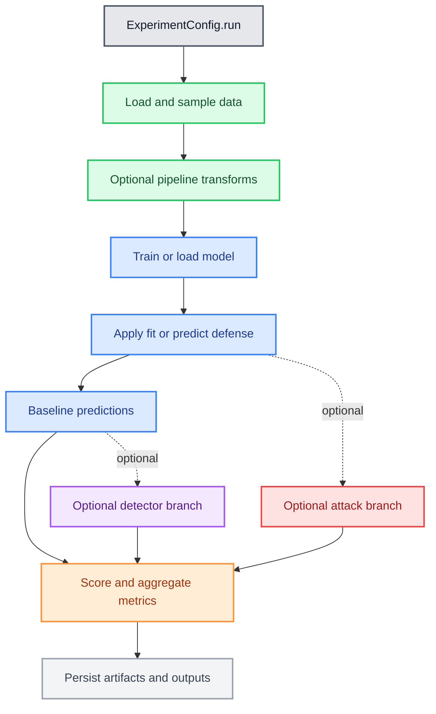

# Default Workflow Flowchart

This page shows the default Deckard workflow as one high-level orchestration
diagram.

Shared semantic color system:

- Data -> green
- Model -> blue
- Attack -> red
- Detector -> purple
- Files -> light gray
- Scores -> orange
- Experiment -> dark gray

## Default Workflow

Canonical orchestration entrypoint: {meth}`deckard.experiment.ExperimentConfig.run`.

## Reading Guide

- The default path is `experiment -> data -> model -> scoring -> files`.
- Attack and detector stages are optional branches that feed back into the
  scoring stage.
- Persistence is the terminal step so downstream notebooks, plots, DVC stages,
  and reruns consume the same saved outputs.
