# Default Workflow Flowchart

This page shows the default Deckard workflow as one high-level orchestration
diagram.

Shared semantic color system:

- Data -> green
- Model -> blue
- Attack -> red
- Detector -> purple
- Files -> light gray
- Scores -> orange
- Experiment -> dark gray
- Plots -> dark gray

## Default Workflow

Canonical orchestration entrypoint: {meth}`deckard.experiment.ExperimentConfig.run`.

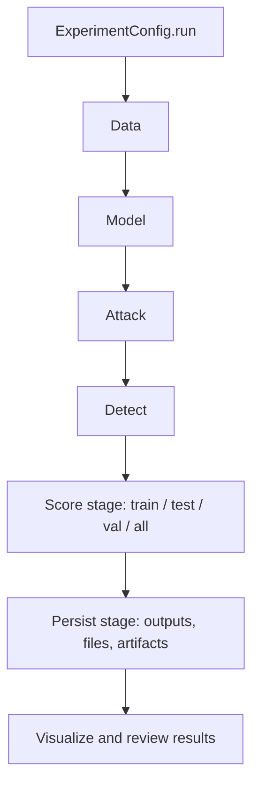

## Reading Guide

- The default path is `load -> sample -> train -> defense -> attack -> detector -> score -> persist`.
- Attack sits after the model has produced baseline outputs so you can compare
  clean and attacked results.
- Detector and scoring come after the attack path, and persistence is followed
  by visualization and review.

## Core API Flowcharts

The flowcharts below are the canonical source for the core object diagrams used
in [Core Modules](core).

### Data API Overview

<!-- core-data-overview-start -->
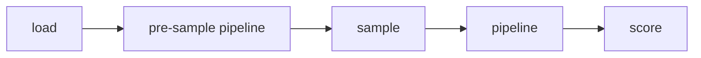
<!-- core-data-overview-end -->

### Model API Overview

<!-- core-model-overview-start -->
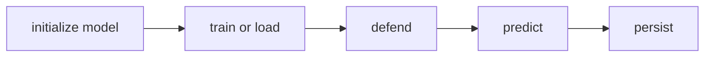
<!-- core-model-overview-end -->

### Model Trainer Scope

<!-- core-model-trainer-scope-start -->
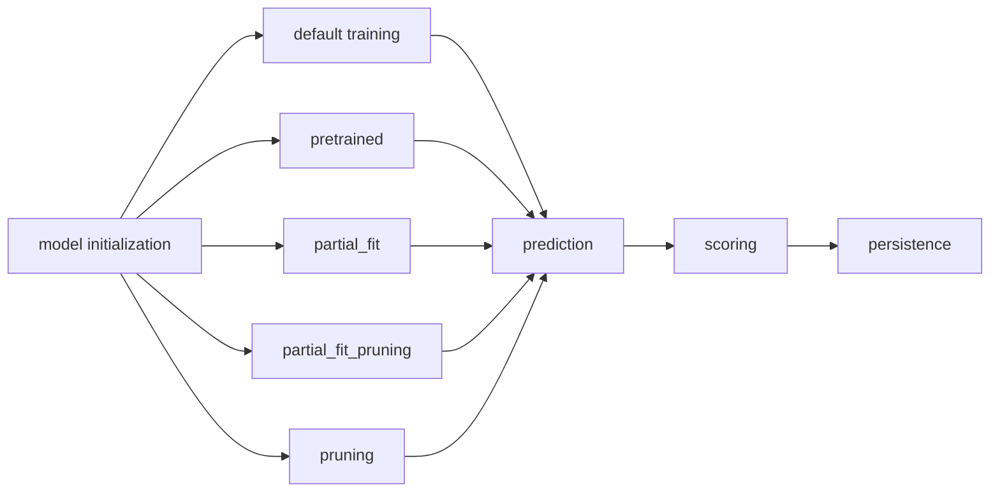
<!-- core-model-trainer-scope-end -->

### Defense Subtypes

<!-- core-defense-subtypes-start -->
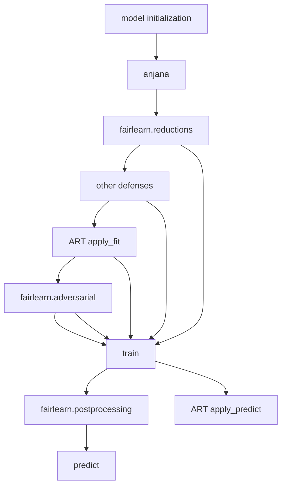
<!-- core-defense-subtypes-end -->

### Attack API Overview

<!-- core-attack-overview-start -->
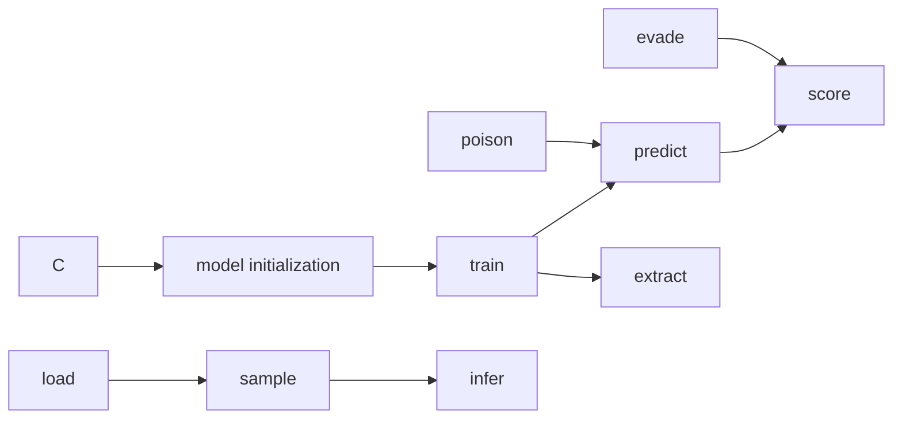
<!-- core-attack-overview-end -->

### Detector API Overview

<!-- core-detector-overview-start -->
```mermaid
flowchart LR
  A[DataConfig]:::data --> B[ModelConfig]:::model -> C[AttackConfig]:::attack
  D[train]:::detector --> E[filter poisoning]:::detector
  D --> F[filter evasion]:::detector
  E --> B --> G[score]:::scores
  F --> C --> G
```
<!-- core-detector-overview-end -->

### Score API Overview

<!-- core-score-overview-start -->
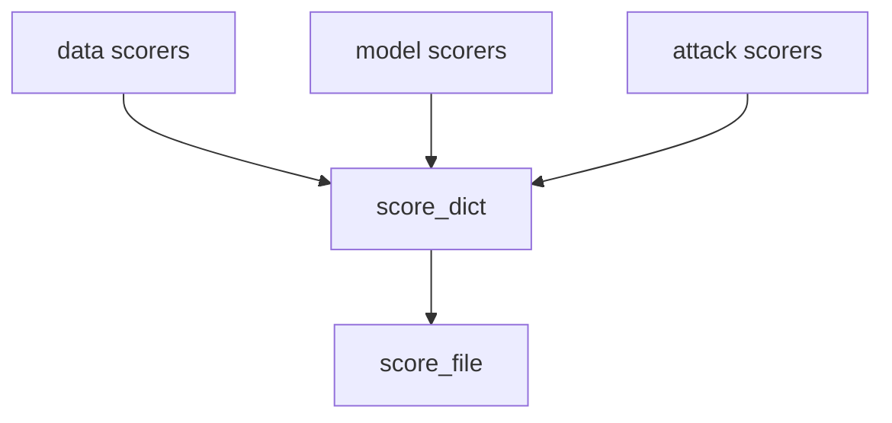
<!-- core-score-overview-end -->

### Experiment API Overview

<!-- core-experiment-overview-start -->
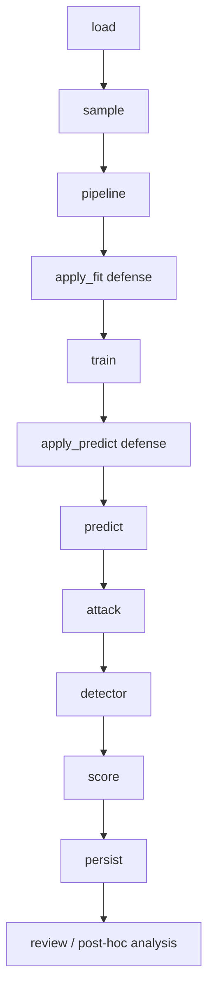
<!-- core-experiment-overview-end -->

### Persistence API Overview

<!-- core-persistence-overview-start -->
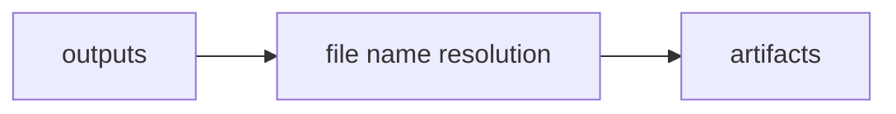
<!-- core-persistence-overview-end -->

## Plugin Flowcharts

### ANJANA Execution Flows
<!-- anjana-data-overview-start -->
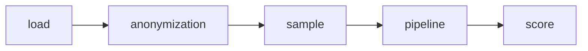
<!-- anjana-data-overview-end -->
### Fairlearn Execution Flows
<!-- fairlearn-model-overview-start -->
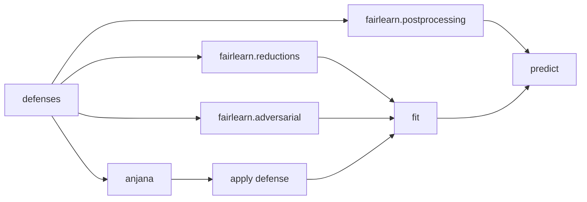
<!-- fairlearn-model-overview-end -->

<!-- fairlearn-score-overview-start -->
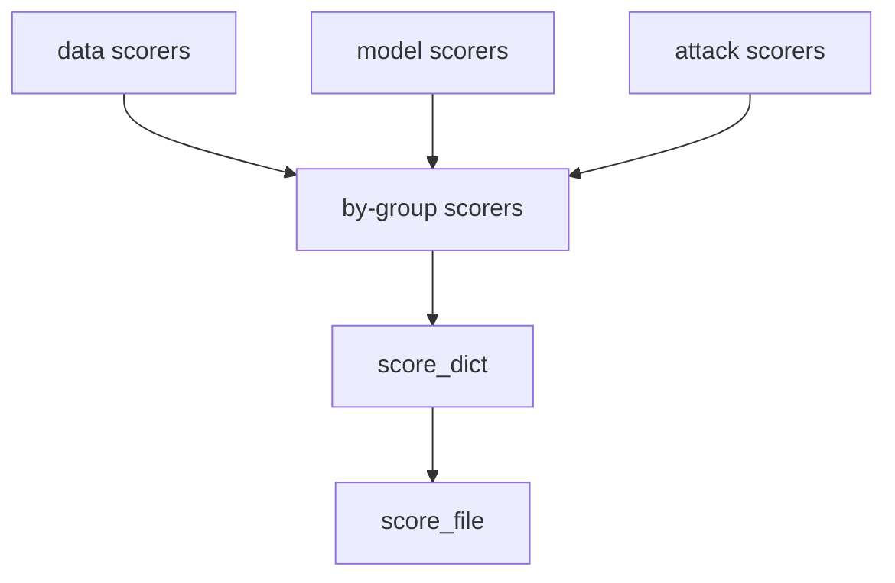
<!-- fairlearn-score-overview-end -->
### Lifelines Execution Flows

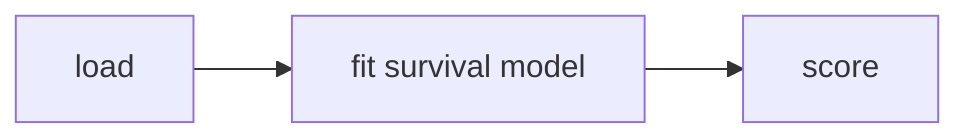

```mermaid
flowchart LR
  A[load historical model data]:::data --> A2[calculate failures benign success (e.g. accuracy)]:::data --> B[fit survival model]:::model --> C[score]:::scores
```

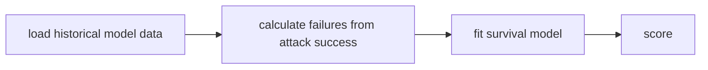

### Yellowbrick Execution Flows

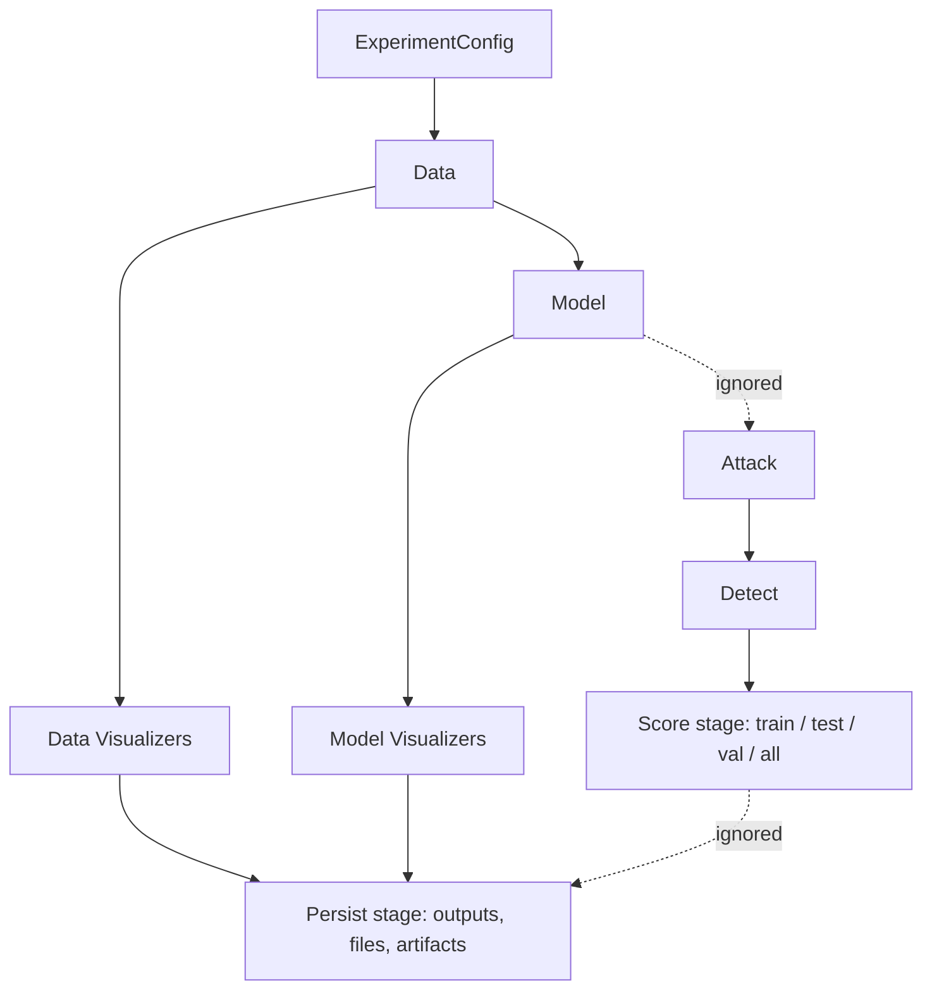

### Seaborn

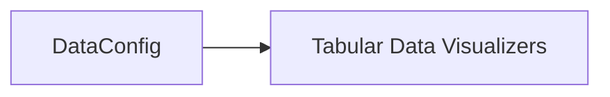
