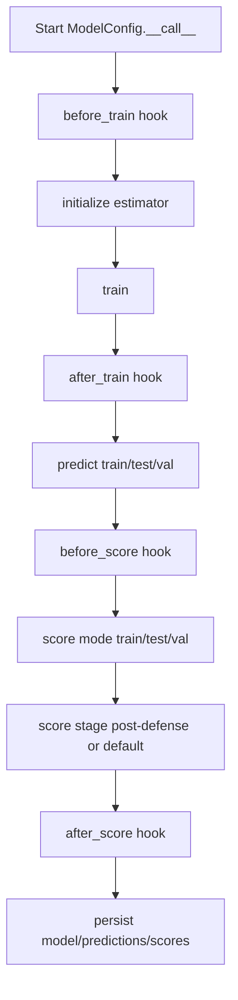
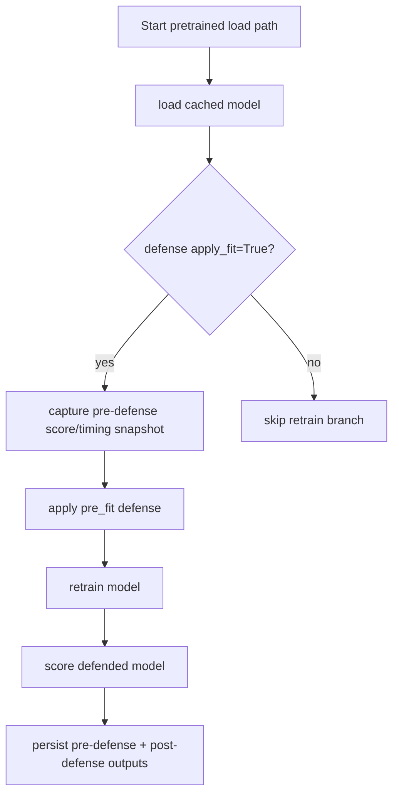
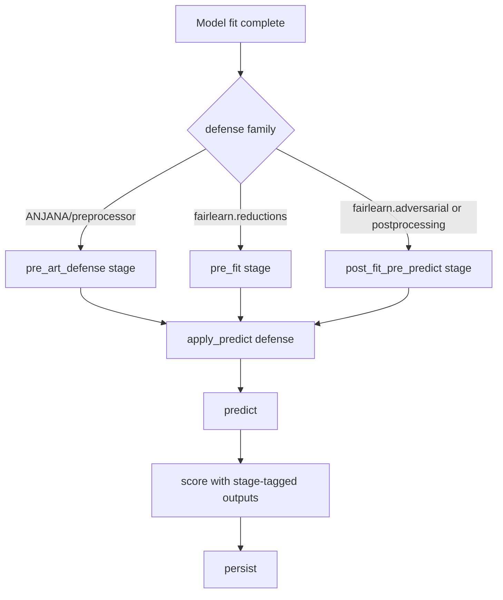

# Model Overview

Deckard's model layer gives you a single orchestration model for training, scoring, persistence, and defense application across core sklearn-style models, PyTorch, Fairlearn, and ANJANA-backed workflows.

## What the model layer does

At a high level, model execution:

1. resolves or constructs the underlying estimator
2. trains or loads the model
3. applies defenses at the correct stage
4. scores the result and preserves timing/state
5. persists artifacts for later reruns

That keeps the user-facing API compact while still supporting several backend families.

## Canonical behavior

The refactor standardized a few important behaviors:

- model configs keep a stable runtime state surface
- defense application is stage-aware
- pretrained models can be retrained when a fit-time defense is required
- the pre-defense state is preserved before retraining
- plugin and framework behavior stays in thin wrappers instead of the core runtime

## Defense stages

Deckard treats model defenses as stage-aware pipeline behavior:

- `pre_art_defense` for ANJANA-style preprocessing before ART wrapping
- `pre_fit` for defenses that must run before training completes
- `post_fit_pre_predict` for defenses applied after training but before prediction

This is what lets a pretrained model pick up a new defense without losing the old score/timing trail.

## Execution Flows

### Flow 1: Standard Train -> Predict -> Score -> Persist

This is the base path for non-pretrained model runs. Hooks surround train and
score boundaries, and scoring is emitted in split-scoped modes.

### Flow 2: Pretrained + apply_fit=True Defense

When a pretrained model receives a fit-time defense, runtime captures a
pre-defense snapshot, retrains with defense enabled, and preserves both score
paths for auditability.

### Flow 3: apply_predict=True and ART/Fairness Defense Stage Branches

Predict-time defenses run after fitting and before prediction. The runtime maps
defense families to canonical stages (`pre_art_defense`, `pre_fit`,
`post_fit_pre_predict`) so scoring remains stage-consistent across plugins and
frameworks.

## Framework-specific extensions

### PyTorch

The PyTorch extension uses the same high-level model contract, but swaps in torch-native estimator and checkpoint behavior.

See {doc}`pytorch` for device handling, runtime artifacts, and torch-specific training paths.

### Fairlearn

Fairlearn adds sensitive-feature-aware training, prediction, and scoring.

See {doc}`fairlearn` for the fairness-specific data and model wrappers.

### ANJANA

ANJANA adds privacy/anonymization policy hooks around the data pipeline.

See {doc}`anjana` for the privacy-oriented runtime behavior.

## Practical guidance

When you build on Deckard's model layer:

- use the top-level config API for normal runs
- use stage-aware defense configuration for robustness workflows
- rely on the runtime to preserve canonical timing and score fields
- keep backend-specific logic inside the framework/plugin wrapper

## Related Docs

- {doc}`data`
- {doc}`../api/model`
- {doc}`scoring`
- {doc}`../api/pytorch`
- {doc}`../api/fairlearn`
- {doc}`../api/anjana`
- {doc}`../developers/model_runtime_canon`
