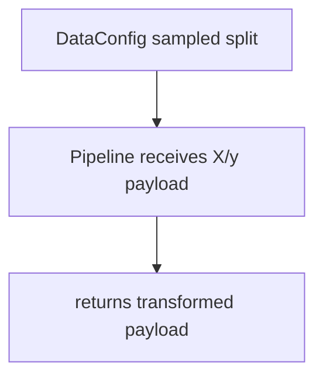
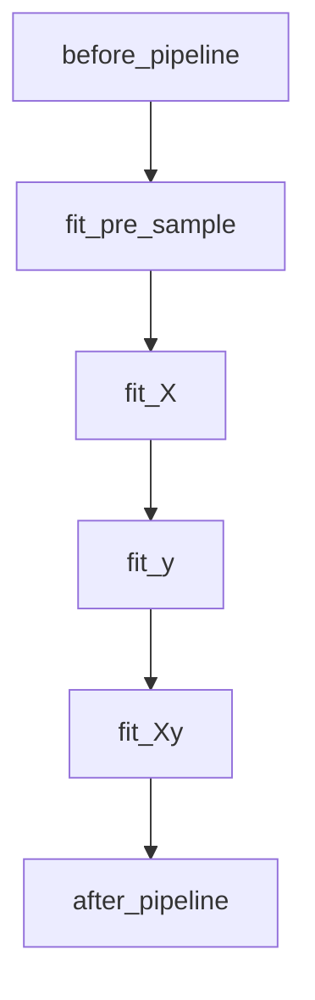
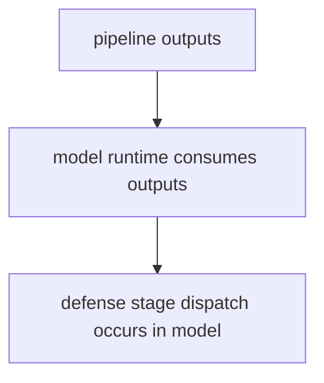
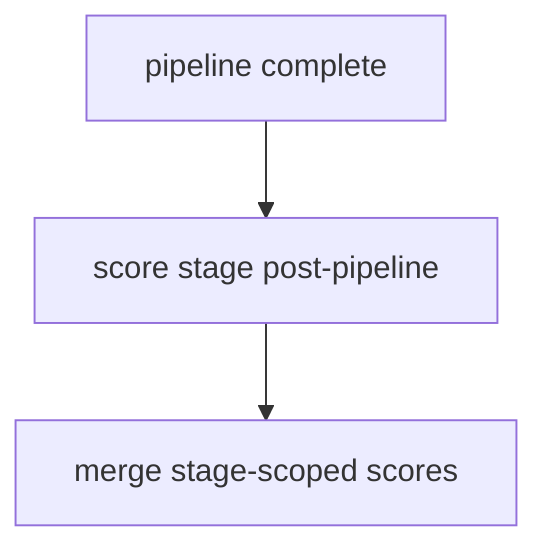
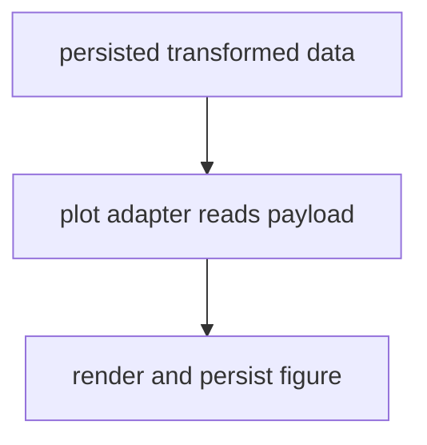

# Pipeline Guide for Base Config Objects

This guide summarizes canonical pipeline behavior for base runtime composition,
primarily through DataPipeline attached to DataConfig.

For comprehensive hook ownership and policy details, see
[Plugin and Hook Execution Reference](../developers/plugin_hook_execution.md).

Related APIs:

- [Data API](../api/data)
- [Pipeline API](../api/pipeline)
- [Scoring API](../api/score)
- [File API](../api/file)
- [Experiment API](../api/experiment)

## Core Role

Pipeline runtime stages execute preprocessing transforms in deterministic order
while preserving split-scoped scoring semantics and files-only persistence.

## Execution Order

1. Resolve stage configuration from DataConfig.pipeline.
2. Run before-stage hooks.
3. Execute staged transforms in canonical order.
4. Run after-stage hooks.
5. Emit stage-aware score boundaries and persist outputs.

## Stage Order

1. fit_pre_sample
2. fit_X
3. fit_y
4. fit_Xy

Each stage can expose before/after hooks and stage-aware scoring boundaries.

## Execution Flows

### Data Flow



### Pipeline Flow



### Defense Flow



### Scoring Flow



### Plot Flow



## YAML Examples

```yaml
data:
    _target_: deckard.data.base.DataConfig
    pipeline:
        scale:
            name: sklearn.preprocessing.StandardScaler
            fit_X: true
```

```yaml
score:
    data:
        scorers:
            missing_ratio:
                score_name: missing_ratio
                score_function: deckard.score.data.missing_ratio
```

## Quick Checklist

- Are pipeline stages deterministic and hook-aware?
- Are pipeline outputs persisted via canonical file aliases?
- Are scoring mode and stage semantics kept separate?
