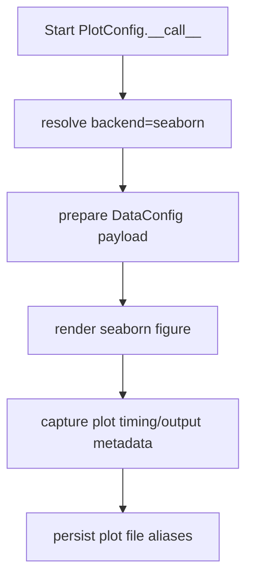
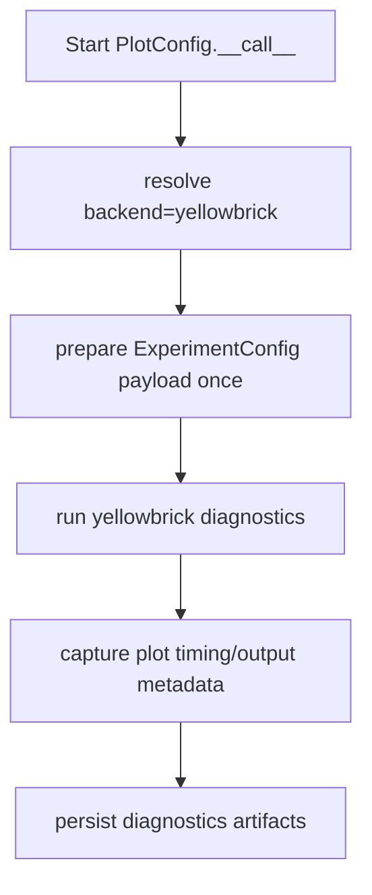
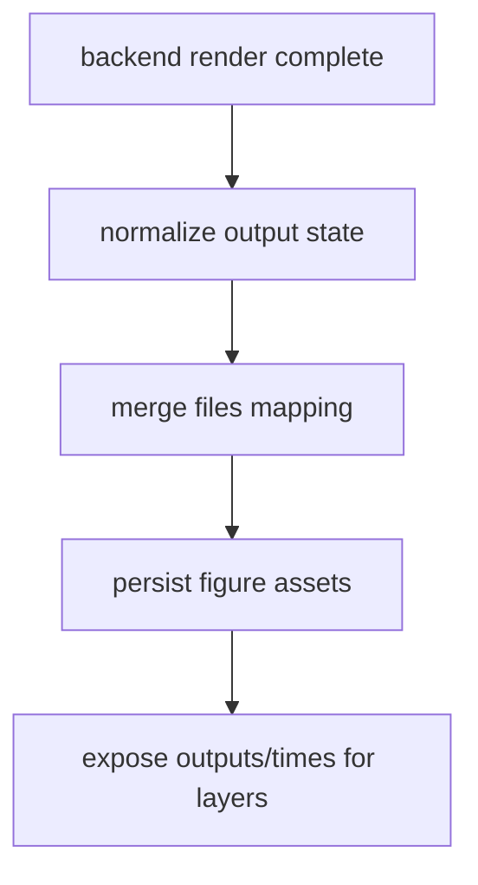

# Plot Guide for Base Config Objects

This guide documents canonical plotting runtime behavior for Deckard base plot
configs and backend adapters.

It covers plotting contract semantics, backend dispatch, and persistence.

Related APIs:

- [Plot API](../api/plot)
- [Layers API](../api/layers)
- [Experiment API](../api/experiment)
- [Data API](../api/data)
- [File API](../api/file)

## Core Concepts

### Canonical Plot Runtime Contract

Plot runtimes share a contract for:

- files: output paths and plot artifact aliases
- times: plotting duration metadata
- output state: backend-generated figures/paths
- backend selection and lazy setup

### Thin Wrapper Policy

Backend-specific modules (Seaborn, Yellowbrick, survival plotting) should only
contain backend policy and adapter logic, not alternate orchestration flows.

### Experiment/Data Preparation Boundaries

- Seaborn modules treat DataConfig payloads as plotting inputs.
- Yellowbrick modules treat ExperimentConfig payloads as plotting inputs.

## Typical Flow

At a high level, plot generation is:

1. resolve plot config and backend
2. prepare data/experiment payload once
3. render plot output
4. persist artifacts via files aliases
5. emit timing and metadata for downstream layers

## Execution Flows

### Flow 1: Seaborn/Data Payload Path

In the seaborn branch, plotting consumes DataConfig-derived payloads and applies
backend-specific rendering while preserving canonical plot persistence.



### Flow 2: Yellowbrick/Experiment Payload Path

In the yellowbrick branch, plotting consumes ExperimentConfig outputs and model
artifacts, then writes diagnostic figures through canonical file aliases.



### Flow 3: Backend-Neutral Persistence Path

Regardless of backend, plot runtime follows one persistence contract. Plot stage
hooks are backend/runtime-specific, while score-stage hooks remain owned by data
/model/attack/detector/experiment runtimes.



## Programmatic Example

```python
from deckard.plot import PlotConfig

plot_cfg = PlotConfig(
    backend="seaborn",
    files={"plot_file": "outputs/plot.png"},
)

result = plot_cfg(data=my_data_cfg)
print(result)
```

## YAML Example

```yaml
plot:
  _target_: deckard.plot.base.PlotConfig
  backend: yellowbrick
  files:
    plot_file: outputs/metrics.png
```

## Recommended Practices

- Keep plotting wrappers thin and backend-specific.
- Persist plot outputs via canonical files aliases.
- Reuse prepared experiment/data payloads to avoid repeated setup.
- Keep plot metadata in canonical output buckets.

## Quick Checklist

- Is backend dispatch canonical and deterministic?
- Is experiment/data preparation done once per plot run?
- Are plot artifacts persisted through files-only paths?
- Are plotting timings and outputs captured for layers workflows?
