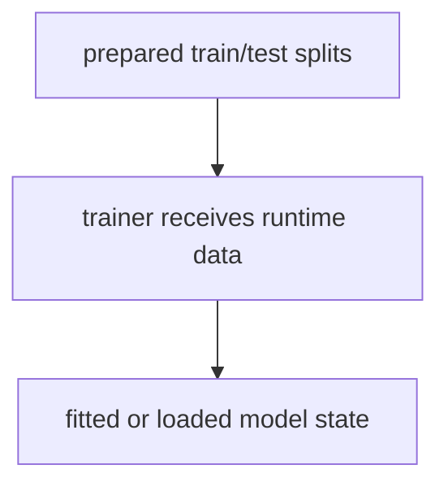
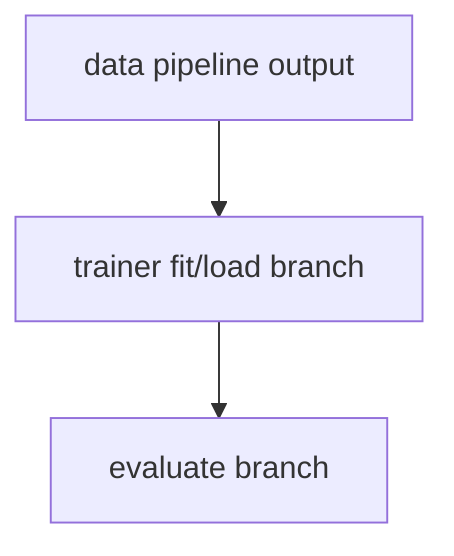
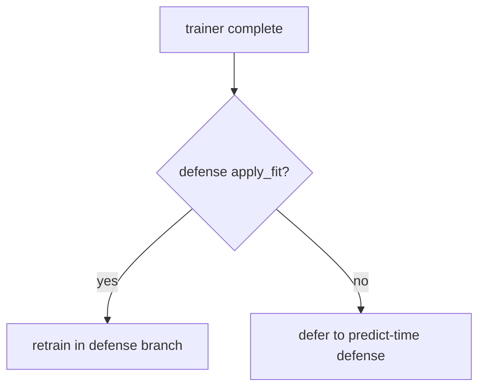
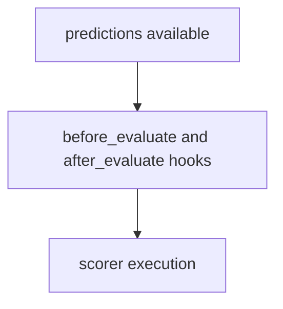
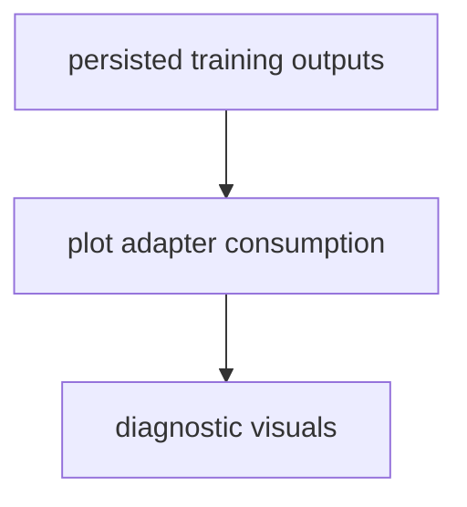

# Trainer Guide for Base Config Objects

This guide summarizes trainer runtime composition used by ModelConfig for
training and load/retrain orchestration.

For comprehensive hook ownership and policy details, see
[Plugin and Hook Execution Reference](../developers/plugin_hook_execution.md).

Related APIs:

- [Model API](../api/model)
- [Scoring API](../api/score)
- [File API](../api/file)
- [Experiment API](../api/experiment)

## Core Role

Trainer runtimes encapsulate training strategy while preserving one canonical
model contract for timing, predictions, scoring, and persistence.

## Execution Order

1. Resolve trainer strategy.
2. Emit before_train_or_load_model hook.
3. Execute train/load branch.
4. Emit after_train_or_load_model hook.
5. Hand off to defense/scoring phases.

Common trainer variants include:

- sklearn/base
- pretrained
- partial_fit
- pruning / partial_fit_pruning
- pytorch

## Execution Flows

### Data Flow



### Pipeline Flow



### Defense Flow



### Scoring Flow



### Plot Flow



## YAML Examples

```yaml
model:
    _target_: deckard.model.base.ModelConfig
    trainer:
        _target_: deckard.model.trainer.base.SklearnTrainerConfig
```

```yaml
model:
    trainer:
        _target_: deckard.model.trainer.base.PretrainedTrainerConfig
    defense:
        pipeline:
            - name: art.defences.preprocessor.FeatureSqueezing
                apply_fit: true
```

## Quick Checklist

- Is trainer behavior strategy-specific but contract-compatible?
- Are pretrained/retrain branches stage-aware?
- Are trainer outputs persisted through canonical model aliases?
