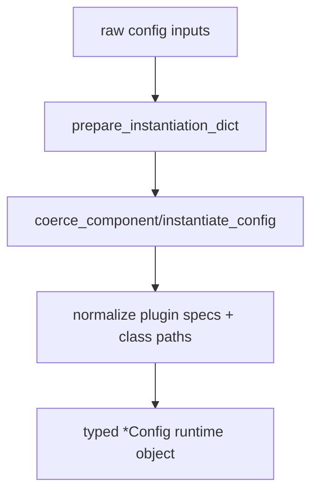
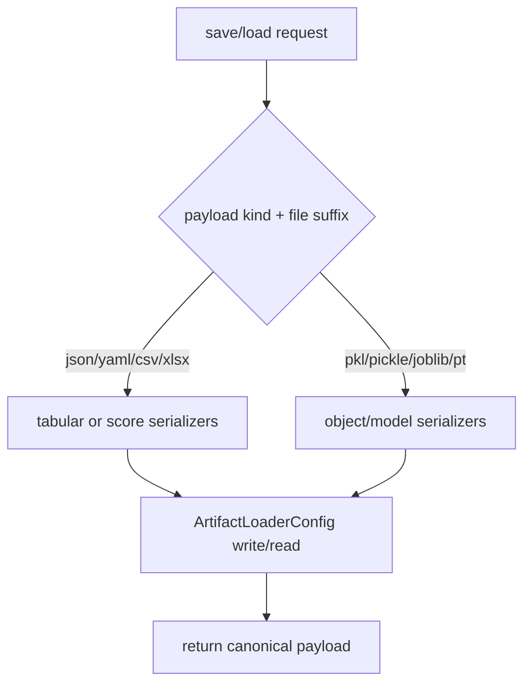
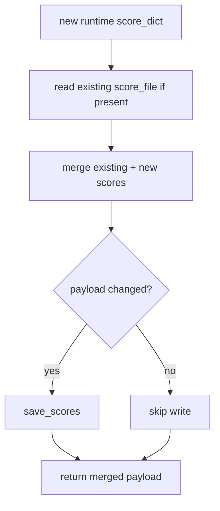

# Utils and Artifacts Guide

This guide documents shared utility and artifact behavior that underpins the
core runtime modules.

Primary modules:

- deckard.utils
- deckard.artifacts

It covers canonical responsibilities for persistence, config coercion,
instantiation, score merging, and runtime helper behavior.

Related APIs:

- [Utils API](../api/utils)
- [Artifacts API](../api/artifacts)
- [File API](../api/file)

## Core Responsibilities

### deckard.artifacts

Artifacts owns load/save behavior for runtime payloads:

- scores
- data matrices/vectors
- model objects
- generic serialized objects

This keeps IO behavior centralized and consistent.

### deckard.utils

Utils owns runtime-neutral helper behavior:

- config coercion and instantiation
- class/plugin resolution
- score merge behavior
- device/runtime utility helpers
- common config base behavior used by core modules

## Canonical Contract Rules

- Persistence behavior should be implemented in artifacts, not duplicated in
  module runtimes.
- Config coercion and normalization should be implemented in utils/helpers.
- Core/framework/plugin modules should consume shared helpers instead of
  defining alternate implementations.

## Typical Flow

At a high level, core modules rely on utils/artifacts to:

1. normalize config inputs
2. instantiate runtime objects and plugins
3. execute runtime logic
4. save/load artifacts through canonical IO functions
5. merge scores and file metadata consistently

## Execution Flows

### Flow 1: ConfigBase Coercion and Runtime Setup Path

Core runtimes call shared utils helpers to normalize config-like inputs into
typed runtime configs before execution. This centralizes lifecycle preparation
and avoids duplicate coercion logic.



### Flow 2: Artifact Persistence Codec Routing

Artifact IO routes by file suffix so each payload type uses the correct codec
while keeping one central persistence implementation.



### Flow 3: Score Merge and Persistence Path

ConfigBase merges new runtime scores with existing persisted scores and writes
only when payloads change, preserving deterministic score-file behavior.



## Programmatic Example

```python
from deckard.artifacts import ArtifactLoaderConfig

artifacts = ArtifactLoaderConfig()
artifacts.save_scores({"accuracy": 0.9}, "outputs/scores.json")
scores = artifacts.load_scores("outputs/scores.json")
print(scores)
```

## Recommended Practices

- Add new persistence types in artifacts first.
- Add shared config/runtime helpers in utils and reuse everywhere.
- Avoid duplicating serializer or coercion logic in feature modules.
- Validate shared helper behavior with focused contract tests.

## Quick Checklist

- Is persistence delegated to artifacts?
- Is config coercion delegated to utils/config base helpers?
- Are score merges using shared utility helpers?
- Are new helpers covered by focused tests?
