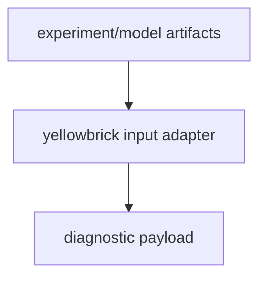
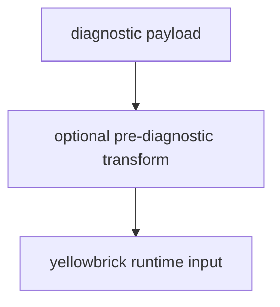
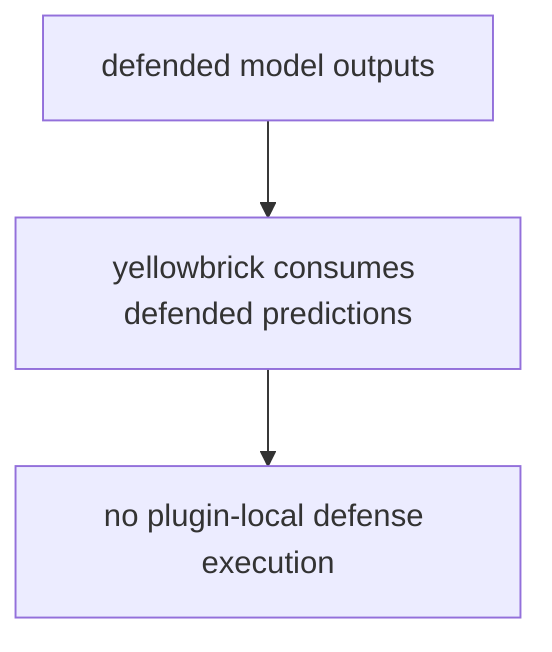
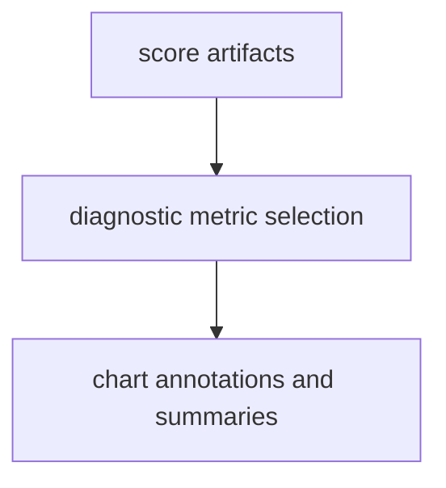
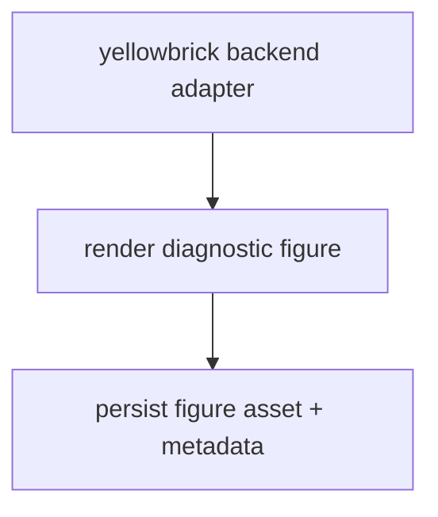

# Yellowbrick Plugin Overview

This overview focuses on Yellowbrick plugin execution order.

For comprehensive hook ownership and policy details, see
[Plugin and Hook Execution Reference](../developers/plugin_hook_execution.md).

Related docs:

- [Data Guide](data.md)
- [Pipeline Guide](pipeline.md)
- [Model Guide](model.md)
- [Defense Guide](defense.md)
- [Scoring Guide](scoring.md)
- [Files Guide](file.md)
- [Artifacts Guide](artifacts.md)
- [Experiment Guide](experiment.md)
- [Plot Guide](plot.md)

## Execution Order

1. Read model/experiment artifacts from canonical outputs.
2. Apply optional pre-diagnostic data preparation.
3. Use defense-aware model outputs from source runtimes.
4. Consume scorer outputs and diagnostic targets.
5. Render yellowbrick diagnostics and persist plot artifacts.

## Execution Flows

### Data Flow



### Pipeline Flow



### Defense Flow



### Scoring Flow



### Plot Flow



## YAML Examples

```yaml
plot:
  _target_: deckard.plugins.yellowbrick.plot.YellowbrickPlotConfig
  files:
    plot_file: outputs/yellowbrick_diagnostic.png
```
