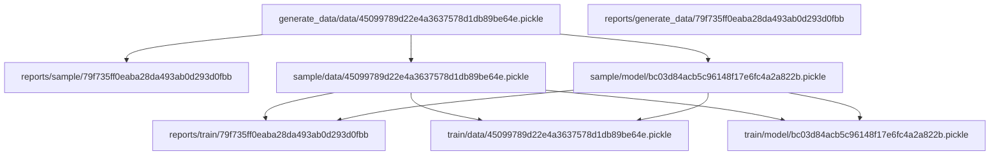

```mermaid
flowchart TD
	node1["generate_data/data/45099789d22e4a3637578d1db89be64e.pickle"]
	node2["reports/sample/79f735ff0eaba28da493ab0d293d0fbb"]
	node3["reports/train/79f735ff0eaba28da493ab0d293d0fbb"]
	node4["sample/data/45099789d22e4a3637578d1db89be64e.pickle"]
	node5["sample/model/bc03d84acb5c96148f17e6fc4a2a822b.pickle"]
	node6["train/data/45099789d22e4a3637578d1db89be64e.pickle"]
	node7["train/model/bc03d84acb5c96148f17e6fc4a2a822b.pickle"]
	node1-->node2
	node1-->node4
	node1-->node5
	node4-->node3
	node4-->node6
	node4-->node7
	node5-->node3
	node5-->node6
	node5-->node7
	node8["reports/generate_data/79f735ff0eaba28da493ab0d293d0fbb"]
```
