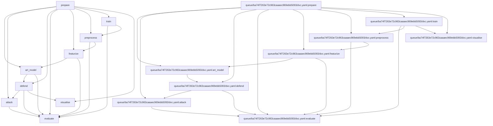

```mermaid
flowchart TD
	node1["art_model"]
	node2["attack"]
	node3["defend"]
	node4["evaluate"]
	node5["featurize"]
	node6["prepare"]
	node7["preprocess"]
	node8["train"]
	node9["visualise"]
	node1-->node3
	node1-->node4
	node2-->node4
	node3-->node2
	node3-->node4
	node3-->node9
	node5-->node1
	node5-->node4
	node6-->node1
	node6-->node2
	node6-->node3
	node6-->node4
	node6-->node5
	node6-->node7
	node6-->node8
	node6-->node9
	node7-->node4
	node7-->node5
	node8-->node4
	node8-->node7
	node10["queue/ba74f7263e72c963caaaec969ebb5093/dvc.yaml:art_model"]
	node11["queue/ba74f7263e72c963caaaec969ebb5093/dvc.yaml:attack"]
	node12["queue/ba74f7263e72c963caaaec969ebb5093/dvc.yaml:defend"]
	node13["queue/ba74f7263e72c963caaaec969ebb5093/dvc.yaml:evaluate"]
	node14["queue/ba74f7263e72c963caaaec969ebb5093/dvc.yaml:featurize"]
	node15["queue/ba74f7263e72c963caaaec969ebb5093/dvc.yaml:prepare"]
	node16["queue/ba74f7263e72c963caaaec969ebb5093/dvc.yaml:preprocess"]
	node17["queue/ba74f7263e72c963caaaec969ebb5093/dvc.yaml:train"]
	node18["queue/ba74f7263e72c963caaaec969ebb5093/dvc.yaml:visualise"]
	node10-->node12
	node11-->node13
	node12-->node11
	node12-->node13
	node14-->node10
	node14-->node13
	node15-->node10
	node15-->node11
	node15-->node12
	node15-->node13
	node15-->node14
	node15-->node16
	node15-->node17
	node15-->node18
	node16-->node13
	node16-->node14
	node17-->node13
	node17-->node16
	node17-->node18
```
