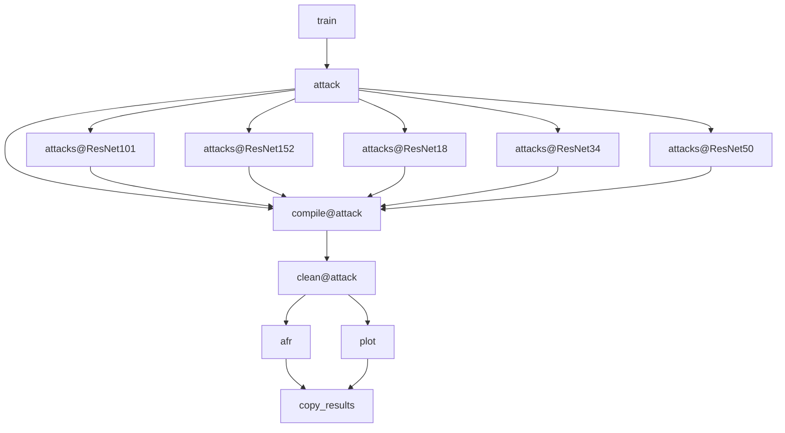

```mermaid
flowchart TD
	node1["afr"]
	node2["attack"]
	node3["attacks@ResNet101"]
	node4["attacks@ResNet152"]
	node5["attacks@ResNet18"]
	node6["attacks@ResNet34"]
	node7["attacks@ResNet50"]
	node8["clean@attack"]
	node9["compile@attack"]
	node10["copy_results"]
	node11["plot"]
	node12["train"]
	node1-->node10
	node2-->node3
	node2-->node4
	node2-->node5
	node2-->node6
	node2-->node7
	node2-->node9
	node3-->node9
	node4-->node9
	node5-->node9
	node6-->node9
	node7-->node9
	node8-->node1
	node8-->node11
	node9-->node8
	node11-->node10
	node12-->node2
```
