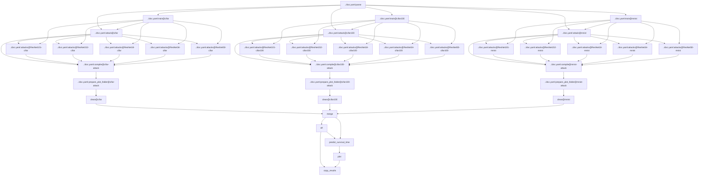

```mermaid
flowchart TD
	node1["../dvc.yaml:attack@cifar"]
	node2["../dvc.yaml:attack@cifar100"]
	node3["../dvc.yaml:attack@mnist"]
	node4["../dvc.yaml:attacks@ResNet101-cifar"]
	node5["../dvc.yaml:attacks@ResNet101-cifar100"]
	node6["../dvc.yaml:attacks@ResNet101-mnist"]
	node7["../dvc.yaml:attacks@ResNet152-cifar"]
	node8["../dvc.yaml:attacks@ResNet152-cifar100"]
	node9["../dvc.yaml:attacks@ResNet152-mnist"]
	node10["../dvc.yaml:attacks@ResNet18-cifar"]
	node11["../dvc.yaml:attacks@ResNet18-cifar100"]
	node12["../dvc.yaml:attacks@ResNet18-mnist"]
	node13["../dvc.yaml:attacks@ResNet34-cifar"]
	node14["../dvc.yaml:attacks@ResNet34-cifar100"]
	node15["../dvc.yaml:attacks@ResNet34-mnist"]
	node16["../dvc.yaml:attacks@ResNet50-cifar"]
	node17["../dvc.yaml:attacks@ResNet50-cifar100"]
	node18["../dvc.yaml:attacks@ResNet50-mnist"]
	node19["../dvc.yaml:compile@cifar-attack"]
	node20["../dvc.yaml:compile@cifar100-attack"]
	node21["../dvc.yaml:compile@mnist-attack"]
	node22["../dvc.yaml:parse"]
	node23["../dvc.yaml:prepare_plot_folder@cifar-attack"]
	node24["../dvc.yaml:prepare_plot_folder@cifar100-attack"]
	node25["../dvc.yaml:prepare_plot_folder@mnist-attack"]
	node26["../dvc.yaml:train@cifar"]
	node27["../dvc.yaml:train@cifar100"]
	node28["../dvc.yaml:train@mnist"]
	node29["afr"]
	node30["clean@cifar"]
	node31["clean@cifar100"]
	node32["clean@mnist"]
	node33["copy_results"]
	node34["merge"]
	node35["plot"]
	node36["predict_survival_time"]
	node1-->node4
	node1-->node7
	node1-->node10
	node1-->node13
	node1-->node16
	node1-->node19
	node2-->node5
	node2-->node8
	node2-->node11
	node2-->node14
	node2-->node17
	node2-->node20
	node3-->node6
	node3-->node9
	node3-->node12
	node3-->node15
	node3-->node18
	node3-->node21
	node4-->node19
	node5-->node20
	node6-->node21
	node7-->node19
	node8-->node20
	node9-->node21
	node10-->node19
	node11-->node20
	node12-->node21
	node13-->node19
	node14-->node20
	node15-->node21
	node16-->node19
	node17-->node20
	node18-->node21
	node19-->node23
	node20-->node24
	node21-->node25
	node22-->node1
	node22-->node2
	node22-->node3
	node22-->node26
	node22-->node27
	node22-->node28
	node23-->node30
	node24-->node31
	node25-->node32
	node26-->node1
	node26-->node4
	node26-->node7
	node26-->node10
	node26-->node13
	node26-->node16
	node27-->node2
	node27-->node5
	node27-->node8
	node27-->node11
	node27-->node14
	node27-->node17
	node28-->node3
	node28-->node6
	node28-->node9
	node28-->node12
	node28-->node15
	node28-->node18
	node29-->node33
	node29-->node36
	node30-->node34
	node31-->node34
	node32-->node34
	node34-->node29
	node34-->node36
	node35-->node33
	node36-->node35
```
