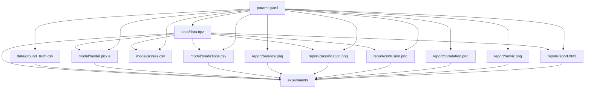

## Params
All of the run-time params are specified in the the conf/ folder. The default configurations are specified in config.yaml.

## Pipeline
The pipeline is described in dvc.yaml, including the metrics, plots, outputs, dependencies, commands, and parameters as specified in that file.

## Dependency graph

To see how each `stage` of said pipeline relates to each other run `dvc dag`.
To see the all of the file system dependencies (the graph below), run: `dvc dag -o --md`.
Files:

